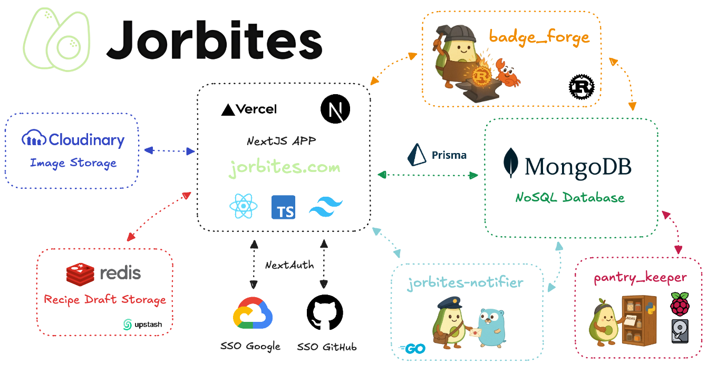

# Jorbites 🥑

**Jorbites** is a modern web platform for sharing and discovering delicious recipes. Users can post their own recipes, interact with the community through likes and comments, participate in events and earn badges for their contributions.

  **🌐 [Visit Jorbites.com](https://jorbites.com)**

  *Join our community of food lovers and discover amazing recipes!*

## Why Jorbites?

A user posted this recipe that indirectly answers the question:

  **🥑 [Why Jorbites?](https://jorbites.com/recipes/68b194a84e84cb9eabfb4350)**

## ✨ Features

- **Recipe Management:** Full CRUD operations with rich text editing and image optimization
- **Social Features:** Like, comment, and share recipes with the community
- **User System:** Leveling, badges, verification, and top jorbiters leaderboard
- **Events:** Participate in cooking challenges and community events
- **Authentication:** Secure SSO via Google and GitHub using NextAuth
- **Image Optimization:** Custom image proxy with Cloudinary integration
- **Security:** Rate limiting with Upstash Redis for API protection
- **Notifications:** Real-time email notifications for user interactions
- **Internationalization:** Multi-language support (English, Spanish, Catalan)
- **Modern UI:** Dark theme support with responsive design

## 🏗️ Architecture

Jorbites follows a modern microservices architecture for scalability and performance:

### Core Platform
- **Main App:** Next.js with TypeScript, deployed on Vercel
- **Database:** MongoDB Atlas with Prisma ORM
- **Authentication:** NextAuth with Google/GitHub providers
- **Images:** Cloudinary with custom proxy implementation
- **Redis:** Recipe draft storage.
- **Rate Limiting:** Upstash Redis for API protection

### Microservices
- **[Jorbites Notifier](https://github.com/jorbush/jorbites-notifier)** (Go): Lightweight notification service with FIFO queue
- **[Badge Forge](https://github.com/jorbush/badge_forge)** (Rust): High-performance badge and level calculation system
- **[Pantry Keeper](https://github.com/jorbush/pantry_keeper)** (Python): Automated database backup system

### Videogames
- **[Paltín Dash](https://github.com/jorbush/paltin-dash)

> **Why Microservices?** This architecture overcomes Vercel's 10-second API function limitation, enabling better scalability and performance for compute-intensive operations.

## 📚 Documentation

- **[Development Setup](docs/development.md)** - Local development guide
- **[Architecture Details](docs/architecture.md)** - Detailed system architecture
- **[API Documentation](docs/api-error-handling.md)** - API endpoints and error handling
- **[Image Optimization](docs/image_optimization.md)** - Image proxy and optimization techniques
- **[Rate Limiting](docs/rate_limit.md)** - Security and rate limiting implementation
