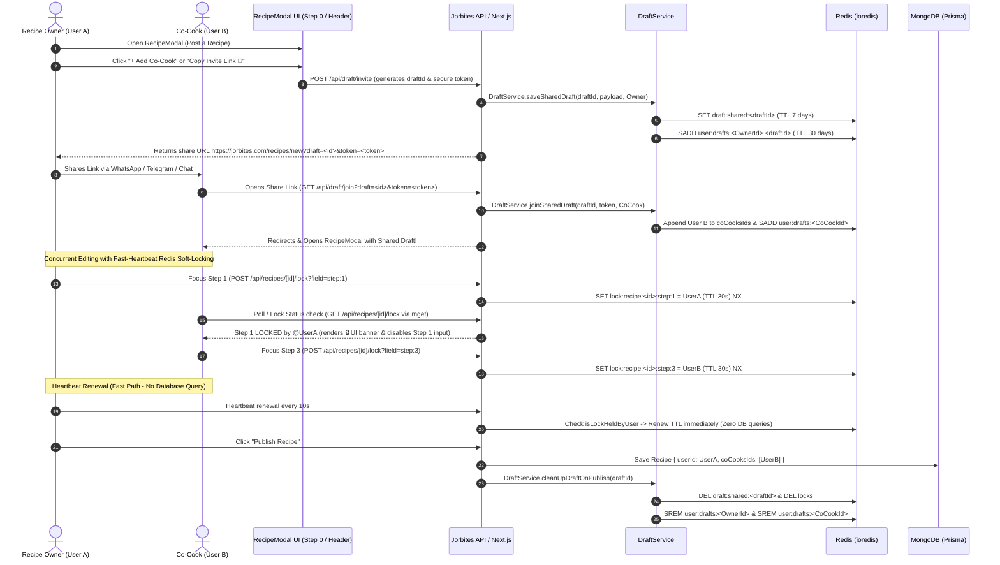

# Collaborative Cooking Feature Documentation

## Overview

The **Collaborative Cooking** feature allows multiple co-authors (`coCooksIds`) to create or edit recipes together in real-time without edit collisions, race conditions, or unauthorized modifications. It leverages:

- **Early Co-Cook Invitation & Shareable Links**: Direct tokenized links that allow users to join a shared draft regardless of whether their notifications are enabled.
- **Upstash Redis Shared Draft Storage & Sets**: Real-time shared state for recipe drafts before publishing, managed with atomic Redis Sets.
- **Section Soft-Locking with Redis**: Section-level locking preventing concurrent edits on the same step or field while co-cooking, with atomic Lua releases and fast heartbeat renewals.
- **In-App Active Shared Draft Banners**: Real-time indicators in the Navbar notifying users when they are part of active co-cooking drafts.
- **Dedicated DraftService Abstraction**: Centralized domain service with field allowlisting, token privacy masking, and automatic cleanup.

---

## Workflows & Architecture Diagram

### 1. Collaborative Draft & Co-Authoring Lifecycle

---

## Redis Key Structure & TTL

| Key Format                                | Purpose                        | TTL                                               | Content / Structure                                                              |
| ----------------------------------------- | ------------------------------ | ------------------------------------------------- | -------------------------------------------------------------------------------- |
| `draft:user:<userId>`                     | Single-user draft storage      | Persistent until publish/delete                   | Recipe draft JSON                                                                |
| `draft:shared:<draftId>`                  | Multi-user collaborative draft | **7 Days** (`DRAFT_TTL_SECONDS = 604800`)         | Sanitized shared draft JSON `{ draftId, inviteToken, ownerId, coCooksIds, ... }` |
| `user:drafts:<userId>`                    | Active draft index per user    | **30 Days** (`USER_DRAFTS_TTL_SECONDS = 2592000`) | **Redis Set** of draft IDs (atomically updated via `SADD`/`SREM`)                |
| `lock:recipe:<targetId>:field:<fieldKey>` | Section/field soft lock        | **30 Seconds** (`LOCK_TTL_SECONDS = 30`)          | JSON `{ userId, userName, userAvatar, timestamp }`                               |

---

## Architecture & System Design Highlights

### 1. Atomic Draft List Management (Redis Sets)

To eliminate read-modify-write race conditions when multiple concurrent sessions invite or delete drafts, user draft tracking uses atomic **Redis Sets** (`SADD` and `SREM`) with a 30-day rolling expiration. Backward compatibility is maintained for legacy JSON arrays.

### 2. Fast Heartbeat Renewal without DB Queries

Soft locks expire after 30 seconds and are renewed every 10 seconds. On heartbeat renewal requests:

- The system executes a fast `isLockHeldByUser` Redis check.
- If the lock is already held by the requester, TTL is renewed immediately **without executing any database queries**.
- Full Prisma/MongoDB authorization checks are only performed on initial lock acquisition.

### 3. Atomic Lock Release (Lua Script)

To avoid Time-of-Check to Time-of-Use (TOCTOU) race conditions where a lock could expire and be acquired by another cook right before a `DEL` command, `releaseLock` uses an atomic Lua script that compares the lock owner ID and deletes only if held by the caller.

### 4. Token Privacy & Security Boundary

- `inviteToken` is only visible to the draft owner (`draft.ownerId`).
- When co-cooks fetch draft data via `GET /api/draft` or `GET /api/draft/active`, `DraftService` automatically sanitizes and removes the `inviteToken`.
- Non-owners cannot regenerate invite tokens (`POST /api/draft/invite` returns 403 Forbidden).
- Co-cooks cannot modify privileged fields such as recipe ownership or co-cook lists on `PATCH /api/recipe/[recipeId]`.

### 5. Field Allowlisting & Pollution Prevention

All incoming draft payloads are strictly filtered against `ALLOWED_DRAFT_FIELDS` before persistence in Redis, preventing prototype pollution or arbitrary payload injection.

### 6. Batch Lock Retrieval (`MGET`)

`getActiveLocks` retrieves all active field locks for a recipe or draft in a single batch `redis.mget` call, eliminating N+1 round-trips.

---

### 7. Smart Non-Destructive Draft Merging

When co-cooks work on different steps concurrently (e.g. User A on Step 1: Ingredients and User B on Step 3: Description), `DraftService.saveDraft` non-destructively merges incoming field updates with existing Redis draft data rather than replacing the entire object. This prevents partial step saves from overwriting fields authored by other co-cooks.

### 8. Real-Time State Synchronization & Background SWR Polling

- **Background Polling**: Active shared drafts in `RecipeModal` poll `GET /api/draft` every 3 seconds via SWR (`refreshInterval: 3000`, `revalidateOnFocus: true`).
- **Selective Form State Sync**: `useRecipeFormState` non-destructively syncs incoming draft updates for all steps _other than_ the active user's current step (`step`). This guarantees that a user's active typing/input state is never clobbered or reset mid-edit.
- **Immediate Navigation Sync**: Form navigation triggers `mutateDraft?.()` on `onNext()` and `onBack()` to immediately sync destination step data upon entering.

### 9. Collaborative Step Validation Handling

- While co-cooking, step inputs are marked required only when `!isCurrentStepLocked`. If a step is actively locked by another collaborator, other co-cooks can advance past that step without triggering false form validation errors.
- Final recipe completeness and data integrity validation remains 100% strictly enforced upon recipe submission at `STEPS.IMAGES` and on backend recipe creation.

---

## Centralized Constants Reference

| Constant                        | Value               | Description                                          |
| ------------------------------- | ------------------- | ---------------------------------------------------- |
| `MAX_CO_COOKS`                  | `4`                 | Maximum number of co-cooks per recipe                |
| `MAX_LINKED_RECIPES`            | `2`                 | Maximum linked recipes per recipe                    |
| `DRAFT_TTL_SECONDS`             | `604800` (7 days)   | Shared draft persistence TTL in Redis                |
| `USER_DRAFTS_TTL_SECONDS`       | `2592000` (30 days) | User active draft list TTL in Redis                  |
| `LOCK_TTL_SECONDS`              | `30`                | Soft-lock expiration duration                        |
| `LOCK_HEARTBEAT_INTERVAL_MS`    | `10000` (10s)       | Heartbeat interval for renewing active section lock  |
| `LOCK_POLL_INTERVAL_MS`         | `4000` (4s)         | Polling interval for detecting co-cook section locks |
| `SHARED_DRAFT_POLL_INTERVAL_MS` | `3000` (3s)         | SWR polling interval for active shared drafts        |

---

## API Endpoints Reference

| Endpoint                 | Method                  | Description                                                                                                                |
| ------------------------ | ----------------------- | -------------------------------------------------------------------------------------------------------------------------- |
| `/api/draft`             | `GET`, `POST`, `DELETE` | Manages single-user or shared drafts via `DraftService`. Non-destructively merges fields; sanitizes tokens for non-owners. |
| `/api/draft/invite`      | `POST`                  | Generates a shared draft ID, secure token, and shareable link (owner only).                                                |
| `/api/draft/join`        | `GET`                   | Validates invite token, adds user to `coCooksIds`, and redirects to shared draft.                                          |
| `/api/draft/active`      | `GET`                   | Returns list of active shared drafts where current user is owner or co-cook (with lazy cleanup).                           |
| `/api/recipes/[id]/lock` | `POST`, `DELETE`, `GET` | Acquires, releases, or fetches section soft-locks with fast heartbeat path.                                                |
| `/api/recipes`           | `POST`                  | Creates published recipe, cleans up shared draft and all locks.                                                            |
| `/api/recipe/[recipeId]` | `PATCH`                 | Updates recipe; allows content edits by `userId` or any user in `coCooksIds`.                                              |

---

## UI Components & Real-Time Indicators

- **Header Top Actions**: Minimalist React Icon buttons with Tooltips in `RecipeModal`:
    - `FiShare2` ("Copy co-cook invite link")
    - `FiUploadCloud` ("Save draft")
- **In-Modal Co-Cooking Status Indicator**: Minimalist status indicator rendered inside `RecipeModal` during multi-user collaborative editing sessions:
    - _`@maria is currently editing another step`_ (Brand `green-450` pill with pulsing dot)
- **Field Lock Banners**: Rendered inside form steps when another co-cook holds an active soft-lock on that step:
    - _`@maria is currently editing this step`_ (Amber pill with pulsing lock indicator)
    - Inputs for locked fields are disabled with visual opacity feedback, while allowing other co-cooks to navigate freely.
