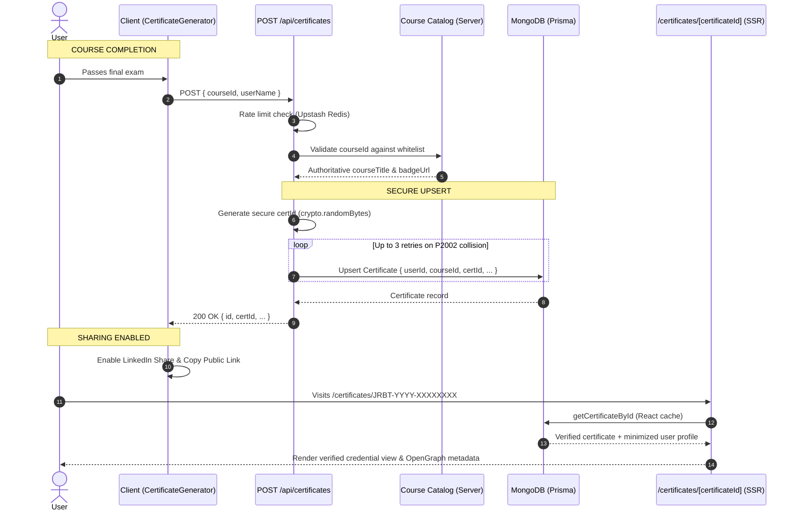

# Course Certificates & Public Verification System

## Overview

The **Course Certificates & Public Verification System** establishes a database-backed source of truth for course completion in Jorbites. Previously, certificates and completion statuses were stored purely in client-side `localStorage`, preventing persistent verification, cross-device access, and public credential sharing.

With this feature:
- Certificates are stored in MongoDB via the Prisma `Certificate` model.
- Each certificate is assigned a unique, cryptographically random identifier (`JRBT-YYYY-XXXXXXXX`) and an authoritative verification URL (`/certificates/[certificateId]`).
- Users can share their achievements directly to LinkedIn with pre-configured credential parameters (`name`, `organizationId`, `certUrl`, `certId`).
- An authoritative server-side course catalog validates requests and prevents tampering with course titles or badge assets.

---

## Architecture & Data Flow



---

## Database Model (`prisma/schema.prisma`)

```prisma
model Certificate {
  id          String   @id @default(auto()) @map("_id") @db.ObjectId
  userId      String   @db.ObjectId
  courseId    String
  courseTitle String
  badgeUrl    String
  certId      String   @unique
  userName    String
  issuedAt    DateTime @default(now())
  createdAt   DateTime @default(now())
  updatedAt   DateTime @updatedAt

  user User @relation(fields: [userId], references: [id], onDelete: Cascade)

  @@unique([userId, courseId])
  @@index([userId])
  @@index([courseId])
  @@index([certId])
}
```

### Key Design Decisions
1. **`@@unique([userId, courseId])`**: Enforces idempotency. A user cannot duplicate certificates for the same course; repeated claims update recipient name while preserving the original `issuedAt` timestamp.
2. **`certId @unique`**: Human-readable, cryptographically random identifier indexed for rapid public resolution.
3. **Cascade Delete**: Deleting a user account cascades to remove their issued certificates.

---

## Authoritative Server Course Catalog (`app/utils/courseCatalog.ts`)

To prevent spoofing where malicious clients claim fabricated certificates or hijack OpenGraph badge images, course metadata is defined authoritatively on the server:

```typescript
export interface CourseCatalogEntry {
    courseId: string;
    courseTitle: string;
    badgeUrl: string;
}

export const COURSE_CATALOG: Record<string, CourseCatalogEntry> = {
    'jorbites-basics': {
        courseId: 'jorbites-basics',
        courseTitle: 'Jorbites Basics',
        badgeUrl: '/badges/badge_basics.jpg',
    },
    // ...whitelisted courses
};
```

- **`isValidCourseId(courseId)`**: Validates incoming requests. Unknown course IDs return `400 Bad Request`.
- Client-provided `courseTitle` and `badgeUrl` parameters in `POST /api/certificates` are ignored in favor of the catalog entry.

---

## Security & Reliability Safeguards

1. **Cryptographic Randomness**:
   - `generateSecureCertId()` uses Node.js `crypto.randomBytes(4)` producing uppercase 8-hex character identifiers: `JRBT-<YEAR>-<HEX8>`.
2. **Collision Retry Handling**:
   - If a rare `P2002` unique constraint violation occurs on `certId`, the API handler retries with a fresh ID up to 3 times before returning an error.
3. **Rate Limiting**:
   - `POST /api/certificates` is protected with `authenticatedRatelimit` (4 requests per 20s) to prevent issuance abuse.
4. **Data Minimization**:
   - Public actions and verification routes project only necessary user fields via `PUBLIC_CERTIFICATE_USER_SELECT_FIELDS` (`id`, `name`, `image`), preventing leakage of emails, verification timestamps, or administrative attributes.
5. **Request Deduplication & Caching**:
   - `getCertificateById` is wrapped in React's `cache()` to eliminate duplicate database queries between `generateMetadata()` and server page rendering.
6. **Graceful Error Separation**:
   - Distinguishes 404 (non-existent certificate) from 500 (database connectivity failure), presenting "Service temporarily unavailable" on outages.

---

## Client Integration & LinkedIn Sharing

### Prevention of Premature 404 Sharing
In `CertificateGenerator.tsx`, LinkedIn sharing and public URL generation are strictly deferred until `certificate?.certId` is returned by the database. Fallback client-generated IDs have been eliminated, ensuring no shared link can point to a 404 page.

### LinkedIn URL Generation
LinkedIn certification links are constructed using LinkedIn's official add-to-profile parameters:

```typescript
const linkedInUrl = new URL('https://www.linkedin.com/profile/add');
linkedInUrl.searchParams.set('startTask', 'CERTIFICATION_NAME');
linkedInUrl.searchParams.set('name', certificate.courseTitle);
linkedInUrl.searchParams.set('organizationName', 'Jorbites');
linkedInUrl.searchParams.set('issueYear', String(issueDate.getFullYear()));
linkedInUrl.searchParams.set('issueMonth', String(issueDate.getMonth() + 1));
linkedInUrl.searchParams.set('certUrl', publicCertUrl);
linkedInUrl.searchParams.set('certId', certificate.certId);
```

---

## Adding a New Course with Certificate Support

When authoring a new course:
1. **Register the course in `app/utils/courseCatalog.ts`**:
   Add the course entry to `COURSE_CATALOG` with its official title and badge path.
2. **Pass `courseId` to `CourseCompleted`**:
   In the course client container:
   ```typescript
   <CourseCompleted
       courseId="my-course-id"
       courseTitle={t('my_course_title')}
       currentUserNames={currentUser?.name}
       badgePath="/badges/my_course_badge.jpg"
   />
   ```
3. **Localization**:
   Ensure translation keys for course titles and descriptions are provided in `public/locales/{en,es,ca}/translation.json`.
