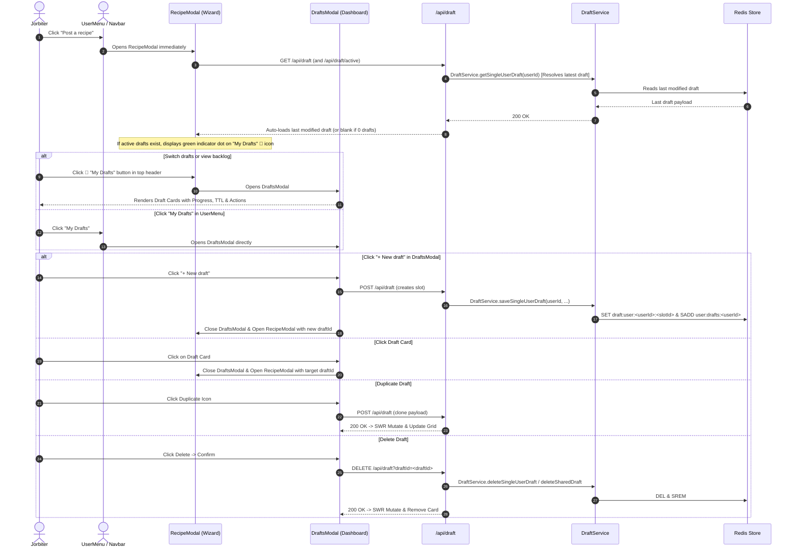

# Drafts & Multi-Draft Management Documentation

## Overview

The **Drafts & Multi-Draft Management** system allows Jorbites users to manage and work on multiple recipe drafts concurrently without losing in-progress work. It seamlessly unifies both **Solo drafts** (up to 5 private drafts per user with 360-day retention) and **Shared collaborative drafts** (multi-author drafts with real-time locking and 7-day retention).

### Key Architectural Principles
- **Modal-First UI**: Rather than requiring dedicated page navigation (`/recipes/drafts`), drafts are surfaced in a rich `DraftsModal` matching the modal UX of `RecipeModal`, `QuestModal`, and `SettingsModal`.
- **Decoupled Logic**: Draft synchronization, persistence, and state management are abstracted into dedicated hooks (`useDraftSync`, `useDraftPersistence`, `useDraftActions`) and utility modules (`draftMetadata.ts`), cleanly separated from the multi-step recipe wizard.
- **Multi-Slot Redis Backend**: Solo drafts use keyed Redis slots (`draft:user:<userId>:<slotId>`) alongside atomic Redis sets (`user:drafts:<userId>`), with backwards compatibility for legacy single-slot drafts.

---

## Redis Key Structure & TTL

| Key Format | Purpose | TTL | Content / Structure |
|---|---|---|---|
| `draft:user:<userId>:<slotId>` | Multi-slot solo draft storage | **365 Days** (`SOLO_DRAFT_TTL_SECONDS = 31536000`) | Recipe draft JSON (up to 5 active slots per user) |
| `draft:user:<userId>` | Legacy solo draft fallback | **365 Days** | Backward-compatible single draft JSON |
| `draft:shared:<draftId>` | Multi-user collaborative draft | **7 Days** (`DRAFT_TTL_SECONDS = 604800`) | Sanitized shared draft JSON with `inviteToken`, `ownerId`, `coCooksIds` |
| `user:drafts:<userId>` | Active draft index per user | **30 Days** (`USER_DRAFTS_TTL_SECONDS = 2592000`) | **Redis Set** of draft IDs (solo and shared combined) |
| `lock:recipe:<targetId>:field:<fieldKey>` | Section/field soft lock | **30 Seconds** (`LOCK_TTL_SECONDS = 30`) | Lock metadata JSON `{ userId, userName, userAvatar, timestamp }` |

---

## Architecture & Workflows

### 1. Multi-Draft User Lifecycle



---

## Component & Hook Hierarchy

```
app/
├── services/
│   └── draftService.ts           # Domain service (multi-slot solo drafts, shared drafts, Redis sets)
├── utils/
│   └── draftFormUtils.ts         # Form extraction & payload collection helpers (extractIngredientsAndSteps, collectDraftFormData)
├── lib/
│   └── draftMetadata.ts          # Pure metadata utilities (generateDraftTitle, getDraftTTLInfo, getDraftProgress)
├── types/
│   └── draft.ts                  # SharedDraft, SingleDraft, DraftSummary, DraftTTLInfo, DraftProgress
├── hooks/
│   ├── useDraftsModal.ts         # Zustand store for DraftsModal visibility
│   ├── useDraftActions.ts        # Standalone CRUD actions (createDraft, deleteDraft, duplicateDraft, shareDraft)
│   ├── useDraftSync.ts           # SWR polling + smart non-destructive remote merge logic
│   └── useDraftPersistence.ts    # Save and deletion logic
├── components/
│   ├── drafts/
│   │   ├── DraftCard.tsx         # Responsive draft card with actions (Share, Duplicate, Delete) and live metadata
│   │   ├── DraftProgressBar.tsx  # 7-dot wizard completion progress indicator
│   │   └── DraftTTLBadge.tsx     # Color-coded TTL pill (amber when expiring soon)
│   └── modals/
│       ├── DraftsModal.tsx       # Modal card grid, empty state, and new draft actions
│       ├── RecipeModal.tsx       # Multi-step wizard consuming decoupled draft hooks
│       └── recipe-steps/
│           └── RecipeModalTopActions.tsx # Header actions (My Drafts folder + dot, Save)
```

---

## Constants Reference

Defined in [`app/utils/constants.ts`](file:///Users/jordi/.gemini/antigravity/worktrees/jorbites/implement_drafts_collaborative_editing/app/utils/constants.ts):

| Constant | Value | Description |
|---|---|---|
| `MAX_SOLO_DRAFT_SLOTS` | `5` | Maximum number of concurrent solo draft slots allowed per user |
| `SOLO_DRAFT_TTL_SECONDS` | `31536000` (365 days) | Expiration time for private solo drafts in Redis |
| `DRAFT_TTL_SECONDS` | `604800` (7 days) | Expiration time for shared collaborative drafts in Redis |
| `USER_DRAFTS_TTL_SECONDS` | `2592000` (30 days) | Expiration time for the user drafts index set in Redis |
| `LOCK_TTL_SECONDS` | `30` | Expiration time for step/field soft locks |
| `LOCK_HEARTBEAT_INTERVAL_MS` | `10000` (10s) | Client lock renewal heartbeat rate |
| `LOCK_POLL_INTERVAL_MS` | `4000` (4s) | Client polling rate for remote field locks |
| `SHARED_DRAFT_POLL_INTERVAL_MS` | `8000` (8s) | Client SWR polling rate for shared draft content |
