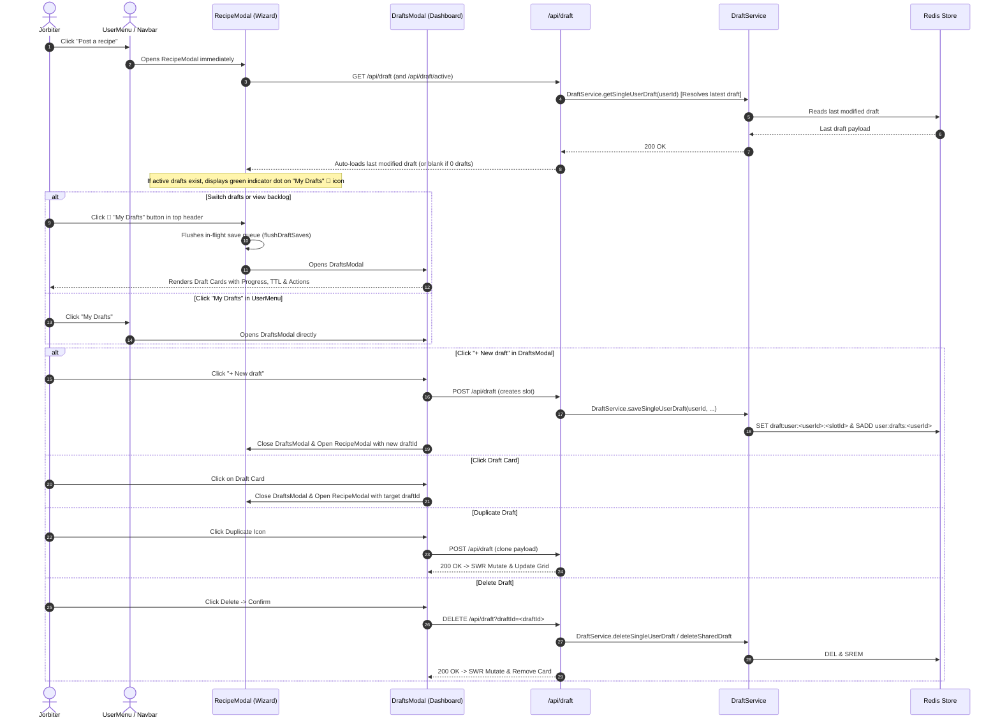

# Drafts & Multi-Draft Management Documentation

## Overview

The **Drafts & Multi-Draft Management** system allows Jorbites users to manage and work on multiple recipe drafts concurrently without losing in-progress work. It seamlessly unifies both **Solo drafts** (up to 5 private drafts per user with 360-day retention) and **Shared collaborative drafts** (multi-author drafts with real-time locking and 7-day retention).

### Key Architectural Principles
- **Modal-First UI**: Rather than requiring dedicated page navigation (`/recipes/drafts`), drafts are surfaced in a rich `DraftsModal` matching the modal UX of `RecipeModal`, `QuestModal`, and `SettingsModal`.
- **Decoupled Logic**: Draft synchronization, persistence, and state management are abstracted into dedicated hooks (`useDraftSync`, `useDraftPersistence`, `useDraftActions`) and utility modules (`draftMetadata.ts`), cleanly separated from the multi-step recipe wizard.
- **Multi-Slot Redis Backend**: Solo drafts use keyed Redis slots (`draft:user:<userId>:<slotId>`) alongside atomic Redis sets (`user:drafts:<userId>`), with backwards compatibility for legacy single-slot drafts.

---

## Redis Key Structure & TTL

| Key Format | Purpose | TTL | Content / Structure |
|---|---|---|---|
| `draft:user:<userId>:<slotId>` | Multi-slot solo draft storage | **365 Days** (`SOLO_DRAFT_TTL_SECONDS = 31536000`) | Recipe draft JSON (up to 5 active slots per user) |
| `draft:user:<userId>` | Legacy solo draft fallback | **365 Days** | Backward-compatible single draft JSON |
| `draft:shared:<draftId>` | Multi-user collaborative draft | **7 Days** (`DRAFT_TTL_SECONDS = 604800`) | Sanitized shared draft JSON with `inviteToken`, `ownerId`, `coCooksIds` |
| `user:drafts:<userId>` | Active draft index per user | **365 Days** (`USER_DRAFTS_INDEX_TTL_SECONDS = 31536000`) | **Redis Set** of draft IDs (solo and shared combined, matching solo draft lifetime) |
| `lock:recipe:<targetId>:field:<fieldKey>` | Section/field soft lock | **30 Seconds** (`LOCK_TTL_SECONDS = 30`) | Lock metadata JSON `{ userId, userName, userAvatar, timestamp }` |

---

## Architecture & Workflows

### 1. Multi-Draft User Lifecycle



---

## Component & Hook Hierarchy

```
app/
├── services/
│   └── draftService.ts           # Domain service (multi-slot solo drafts, shared drafts, Redis sets, atomic quota)
├── utils/
│   ├── draftFormUtils.ts         # Form extraction & step-scoped payload collection (extractIngredientsAndSteps, collectDraftFormData)
│   └── draftSyncUtils.ts         # Pure conflict-avoidance synchronization & slot-level dirty checks (syncRemoteDraftToForm)
├── lib/
│   └── draftMetadata.ts          # Pure metadata utilities (generateDraftTitle, getDraftTTLInfo, getDraftProgress)
├── types/
│   └── draft.ts                  # SharedDraft, SingleDraft, DraftData, SaveDraftPayload, DraftTTLInfo, DraftProgress
├── hooks/
│   ├── useDraftsModal.ts         # Zustand store for DraftsModal visibility
│   ├── useDraftActions.ts        # Standalone CRUD actions (createDraft, deleteDraft, duplicateDraft, shareDraft)
│   ├── useDraftSync.ts           # SWR polling + non-destructive remote merge logic
│   └── useDraftPersistence.ts    # Serialized save promise queue, copy invite link, and deletion logic
├── components/
│   ├── drafts/
│   │   ├── DraftCard.tsx         # Responsive draft card with actions (Share, Duplicate, Delete) and live metadata
│   │   ├── DraftProgressBar.tsx  # 7-dot wizard completion progress indicator
│   │   └── DraftTTLBadge.tsx     # Color-coded TTL pill (amber when expiring soon)
│   └── modals/
│       ├── DraftsModal.tsx       # Modal card grid, empty state, and new draft actions
│       ├── RecipeModal.tsx       # Multi-step wizard consuming decoupled draft hooks
│       └── recipe-steps/
│           └── RecipeModalTopActions.tsx # Header actions (My Drafts folder + dot, Save)
```

---

## Constants Reference

Defined in [`app/utils/constants.ts`](file:///Users/jordi/.gemini/antigravity/worktrees/jorbites/implement_drafts_collaborative_editing/app/utils/constants.ts):

| Constant | Value | Description |
|---|---|---|
| `MAX_SOLO_DRAFT_SLOTS` | `5` | Maximum number of concurrent solo draft slots allowed per user |
| `SOLO_DRAFT_TTL_SECONDS` | `31536000` (365 days) | Expiration time for private solo drafts in Redis |
| `DRAFT_TTL_SECONDS` | `604800` (7 days) | Expiration time for shared collaborative drafts in Redis |
| `USER_DRAFTS_INDEX_TTL_SECONDS` | `31536000` (365 days) | Expiration time for the user drafts index set in Redis (matches solo draft retention) |
| `LOCK_TTL_SECONDS` | `30` | Expiration time for step/field soft locks |
| `LOCK_HEARTBEAT_INTERVAL_MS` | `10000` (10s) | Client lock renewal heartbeat rate |
| `LOCK_POLL_INTERVAL_MS` | `4000` (4s) | Client polling rate for remote field locks |
| `SHARED_DRAFT_POLL_INTERVAL_MS` | `8000` (8s) | Client SWR polling rate for shared draft content |

---

## Testing Strategy & Test Suites

The drafts and collaborative editing system is thoroughly verified across unit, integration, and E2E testing layers:

### 1. Unit & Integration Tests (Jest & Vitest)

| Test File | Framework | Scope & Capabilities Tested |
|---|---|---|
| [`draftFormUtils.test.ts`](file:///__tests__/unit_test/utils/draftFormUtils.test.ts) | Vitest | Full recipe state extraction from later wizard steps, 30-slot ingredient & step scanning, step-scoped shared patches across all 7 steps, intentional empty array preservation (`[]`). |
| [`draftSyncUtils.test.ts`](file:///__tests__/unit_test/utils/draftSyncUtils.test.ts) | Vitest | Pure equality checks, local modification slot-level dirty detection, inactive vs. active vs. locked step synchronization heuristics. |
| [`useRecipeFormState.test.ts`](file:///__tests__/unit_test/components/modals/recipe-steps/useRecipeFormState.test.ts) | Vitest | Wizard step derivation, render-time draft adjustment, pure state updaters, ingredients preservation during step navigation. |
| [`useDraftPersistence.test.ts`](file:///__tests__/unit_test/hooks/useDraftPersistence.test.ts) | Vitest | Save draft triggers, promise queue serialization (`saveQueueRef`), in-flight save flushing (`flushDraftSaves`), error handling toasts, mutation revalidation. |
| [`useDraftActions.test.ts`](file:///__tests__/unit_test/hooks/useDraftActions.test.ts) | Vitest | Modal-level draft actions: duplicate draft, delete draft with optimistic update, share link generation, 409 quota error handling. |
| [`draftMetadata.test.ts`](file:///__tests__/unit_test/utils/draftMetadata.test.ts) | Vitest | Title generation heuristics, TTL color badge determination, progress calculation (0–7 steps). |
| [`draftService.multiSlot.test.ts`](file:///__tests__/unit_test/lib/draftService.multiSlot.test.ts) | Jest | Redis multi-slot solo storage, 5-draft slot cap, atomic Lua creation quotas, explicit-ID bypass prevention, solo/shared quota isolation, 365-day index TTL refresh. |
| [`draft.multiSlot.test.ts`](file:///__tests__/unit_test/routes/draft.multiSlot.test.ts) | Jest | API endpoint `/api/draft` and `/api/draft/active` multi-slot routing, query param slot filtering, error response codes. |

### 2. End-to-End Tests (Cypress)

| Spec File | Test Cases & Key User Flows |
|---|---|
| [`drafts_management.cy.ts`](file:///__tests__/e2e/drafts_management.cy.ts) | 1. **Empty State**: Opens `DraftsModal` from `UserMenu` when 0 drafts exist.<br/>2. **Draft Lifecycle**: Creates draft, auto-loads on re-open, accesses `DraftsModal` from inside `RecipeModal`, duplicates, deletes.<br/>3. **Zero-Draft Reset**: Deleting all drafts cleans up Redis shadow keys completely.<br/>4. **Multi-Step Persistence**: Saves draft from Step 5 (Related Content), restores all 5 steps backward upon reload.<br/>5. **In-Session Draft Switching**: Switches between Draft A (Strawberry Tart on Step 4) and Draft B (Garlic Bread on Step 2) without state leakage.<br/>6. **Publish Cleanup**: Solo draft is cleanly purged from Redis upon recipe creation; reopening `RecipeModal` starts with fresh empty state.<br/>7. **Slot Limit Enforcement**: Duplicates up to 5 drafts, rejects 6th with 409 (`MAX_SOLO_DRAFTS_REACHED`), frees slot on delete.<br/>8. **Mixed Drafts Grid**: Displays mixed Solo (365d TTL) and Collaborative (7d TTL) cards in `DraftsModal` side-by-side with distinct badges and actions.<br/>9. **Plain-Text Mode Persistence**: Toggles raw text mode on Ingredients and Steps, applies parsed lists, saves draft, and restores all parsed items after page reload.<br/>10. **Intentional Empty Arrays**: Clears all ingredient inputs, saves, reloads, and verifies empty state is preserved without reviving previous items.<br/>11. **In-Flight Save Modal Transition**: Types title and immediately clicks header "My Drafts" button; verifies save is flushed before opening `DraftsModal`. |
| [`drafts_navigation.cy.ts`](file:///__tests__/e2e/drafts_navigation.cy.ts) | 1. **Entry Point Behavior**: Click "Post a recipe" with 0 drafts vs existing draft.<br/>2. **Indicator Dot**: Displays green indicator dot on header folder icon when drafts exist.<br/>3. **User Menu Navigation**: "My Drafts" directly opens `DraftsModal`. |
| [`collaborative_recipes.cy.ts`](file:///__tests__/e2e/collaborative_recipes.cy.ts) | 1. **Collaborative Lifecycle**: Invites co-cooks, joins via tokenized link, synchronizes steps in real-time, publishes collaborative recipe.<br/>2. **Soft-Locking**: Displays lock banners and disables inputs when a co-cook is editing.<br/>3. **Concurrent Edits**: Non-destructive field merging without race condition loss.<br/>4. **Capacity**: Enforces 4 co-cook limit. |


