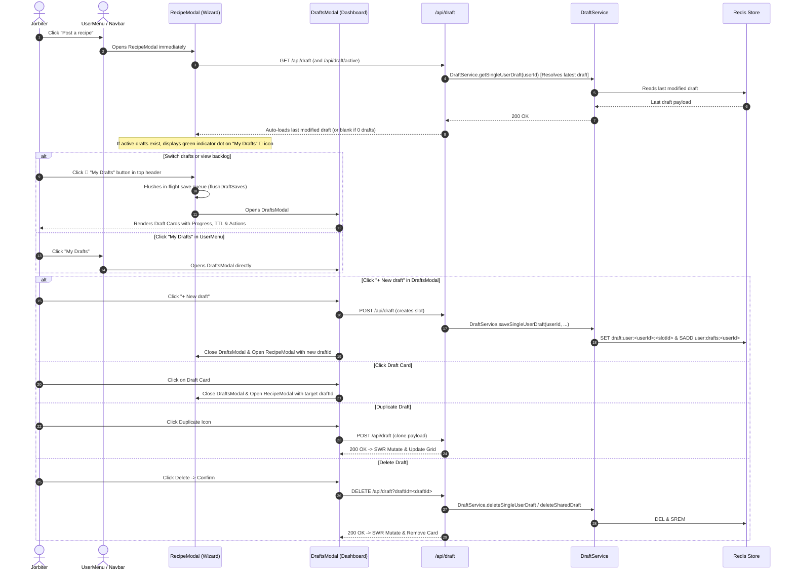

# Drafts & Multi-Draft Management Documentation

## Overview

The **Drafts & Multi-Draft Management** system allows Jorbites users to manage and work on multiple recipe drafts concurrently without losing in-progress work. It seamlessly unifies both **Solo drafts** (up to 5 private drafts per user with 360-day retention) and **Shared collaborative drafts** (multi-author drafts with real-time locking and 7-day retention).

### Key Architectural Principles
- **Modal-First UI**: Rather than requiring dedicated page navigation (`/recipes/drafts`), drafts are surfaced in a rich `DraftsModal` matching the modal UX of `RecipeModal`, `QuestModal`, and `SettingsModal`.
- **Decoupled Logic**: Draft synchronization, persistence, and state management are abstracted into dedicated hooks (`useDraftSync`, `useDraftPersistence`, `useDraftActions`) and utility modules (`draftMetadata.ts`), cleanly separated from the multi-step recipe wizard.
- **Multi-Slot Redis Backend**: Solo drafts use keyed Redis slots (`draft:user:<userId>:<slotId>`) alongside atomic Redis sets (`user:drafts:<userId>`), with backwards compatibility for legacy single-slot drafts.

---

## Redis Key Structure & TTL

| Key Format | Purpose | TTL | Content / Structure |
|---|---|---|---|
| `draft:user:<userId>:<slotId>` | Multi-slot solo draft storage | **365 Days** (`SOLO_DRAFT_TTL_SECONDS = 31536000`) | Recipe draft JSON (up to 5 active slots per user) |
| `draft:shared:<draftId>` | Multi-user collaborative draft | **7 Days** (`DRAFT_TTL_SECONDS = 604800`) | Sanitized shared draft JSON with `inviteToken`, `ownerId`, `coCooksIds` |
| `user:solo-drafts:<userId>` | Active solo draft index | **365 Days** (`SOLO_DRAFT_TTL_SECONDS = 31536000`) | **Redis Set** of solo draft IDs per user |
| `user:drafts:<userId>` | Combined active draft index per user | **365 Days** (`USER_DRAFTS_INDEX_TTL_SECONDS = 31536000`) | **Redis Set** of draft IDs (solo and shared combined, matching solo draft lifetime) |
| `lock:recipe:<targetId>:field:<fieldKey>` | Section/field soft lock | **30 Seconds** (`LOCK_TTL_SECONDS = 30`) | Lock metadata JSON `{ userId, userName, userAvatar, timestamp }` |

> [!NOTE]
> Legacy un-slotted storage keys (`draft:user:<userId>` and raw `<userId>`) have been deprecated and eliminated. All drafts are indexed cleanly via native Redis sets. Co-cook joins use an atomic Lua script (`JOIN_SHARED_DRAFT_SCRIPT`) to prevent TOCTOU race conditions and strictly enforce `MAX_CO_COOKS = 4`.

---

## Architecture & Workflows

### 1. Multi-Draft User Lifecycle



---

## Component & Hook Hierarchy

```
app/
├── services/
│   └── draftService.ts           # Domain service (multi-slot solo drafts, shared drafts, Redis sets, atomic quota)
├── utils/
│   ├── draftFormUtils.ts         # Form extraction & step-scoped payload collection (extractIngredientsAndSteps, collectDraftFormData)
│   └── draftSyncUtils.ts         # Pure conflict-avoidance synchronization & slot-level dirty checks (syncRemoteDraftToForm)
├── lib/
│   └── draftMetadata.ts          # Pure metadata utilities (generateDraftTitle, getDraftTTLInfo, getDraftProgress)
├── types/
│   └── draft.ts                  # SharedDraft, SingleDraft, DraftData, SaveDraftPayload, DraftTTLInfo, DraftProgress
├── hooks/
│   ├── useDraftsModal.ts         # Zustand store for DraftsModal visibility
│   ├── useDraftActions.ts        # Standalone CRUD actions (createDraft, deleteDraft, duplicateDraft, shareDraft)
│   ├── useDraftSync.ts           # SWR polling + non-destructive remote merge logic
│   └── useDraftPersistence.ts    # Serialized save promise queue, copy invite link, and deletion logic
├── components/
│   ├── drafts/
│   │   ├── DraftCard.tsx         # Responsive draft card with actions (Share, Duplicate, Delete) and live metadata
│   │   ├── DraftProgressBar.tsx  # 7-dot wizard completion progress indicator
│   │   └── DraftTTLBadge.tsx     # Color-coded TTL pill (amber when expiring soon)
│   └── modals/
│       ├── DraftsModal.tsx       # Modal card grid, empty state, and new draft actions
│       ├── RecipeModal.tsx       # Multi-step wizard consuming decoupled draft hooks
│       └── recipe-steps/
│           └── RecipeModalTopActions.tsx # Header actions (My Drafts folder + dot, Save)
```

---

## Constants Reference

Defined in [`app/utils/constants.ts`](file:///Users/jordi/.gemini/antigravity/worktrees/jorbites/implement_drafts_collaborative_editing/app/utils/constants.ts):

| Constant | Value | Description |
|---|---|---|
| `MAX_SOLO_DRAFT_SLOTS` | `5` | Maximum number of concurrent solo draft slots allowed per user |
| `SOLO_DRAFT_TTL_SECONDS` | `31536000` (365 days) | Expiration time for private solo drafts in Redis |
| `DRAFT_TTL_SECONDS` | `604800` (7 days) | Expiration time for shared collaborative drafts in Redis |
| `USER_DRAFTS_INDEX_TTL_SECONDS` | `31536000` (365 days) | Expiration time for the user drafts index set in Redis (matches solo draft retention) |
| `LOCK_TTL_SECONDS` | `30` | Expiration time for step/field soft locks |
| `LOCK_HEARTBEAT_INTERVAL_MS` | `10000` (10s) | Client lock renewal heartbeat rate |
| `LOCK_POLL_INTERVAL_MS` | `4000` (4s) | Client polling rate for remote field locks |
| `SHARED_DRAFT_POLL_INTERVAL_MS` | `8000` (8s) | Client SWR polling rate for shared draft content |

---

## Security & Data Integrity Protections

1. **Client Payload Sanitization**:
   - Both shared (`saveSharedDraft`) and solo (`saveSingleUserDraft`) draft paths enforce strict field allowlists (`ALLOWED_DRAFT_FIELDS`), stripping prototype pollution and arbitrary injected fields.
   - `inviteToken` is removed from client-updatable fields: invite tokens can only be generated server-side during draft creation via `/api/draft/invite`.
2. **Safe Co-Cook Roster Management**:
   - Non-owners (co-cooks) can never modify or wipe the `coCooksIds` roster when saving their edits.
   - Owners saving steps other than the Related Content step will not accidentally overwrite existing joined co-cooks with an empty array.
3. **Atomic Joining & Quota Guard**:
   - `DraftService.joinSharedDraft` uses an atomic Redis Lua script (`JOIN_SHARED_DRAFT_SCRIPT`) enforcing `MAX_CO_COOKS = 4` without TOCTOU race conditions.
4. **Stable Lock Handlers & Concurrency Control**:
   - `useRecipeLock` keeps stable functional references for `acquire` and `release` via refs and `useMemo`, preventing infinite or repeated re-render cycles.
   - Lock acquisition and renewals use atomic Lua scripts (`ACQUIRE_OR_RENEW_SCRIPT` / `renewLockIfHeld`), eliminating TOCTOU lock-stealing windows and performing lock renewals in a single network roundtrip without database queries.
5. **Route Authorization & Target Validation**:
   - `/api/recipes/[id]/lock` validates authentication on all methods (`GET`, `POST`, `DELETE`).
   - Unauthenticated requests receive `401 Unauthorized`. Non-existent targets receive `404 Not Found`. Users who are neither the recipe/draft owner nor an active co-cook receive `403 Forbidden`.
6. **Invite Token Privacy**:
   - `POST /api/draft` responses mask `inviteToken` when saved by a co-cook using `DraftService.maskSharedDraft`, ensuring non-owners cannot inspect or leak the token.
7. **Solo Draft Lightweight Isolation**:
   - Solo drafts bypass the lock polling and acquisition subsystem entirely, ensuring single-user draft editing incurs zero lock overhead.
8. **Server-Only Invite Token Generation (M4)**:
   - `POST /api/draft/invite` ignores any client-supplied `inviteToken` in the payload. Tokens are strictly generated on the server using cryptographically secure random bytes (`crypto.randomBytes(16).toString('hex')`) or preserved from the draft's existing record.
9. **Lock Key Pattern Sanitization (M2)**:
   - `releaseAllLocks(targetId)` validates `targetId` and escapes all glob special characters (`*`, `?`, `[`, `]`) to prevent unintended multi-key deletion.
10. **Keyboard Focus Trapping & Accessibility (H7, H12, M12)**:
    - Locked step containers specify the HTML `inert` attribute when locked by a collaborator, completely blocking keyboard `Tab` navigation, focus, and typing into locked fields.
    - Icon-only action buttons in `DraftCard` provide accessible `aria-label` attributes alongside visual tooltips.
    - `DraftProgressBar` implements `role="progressbar"`, `aria-valuenow`, `aria-valuemin`, and `aria-valuemax`.
11. **Sync Ghost Write Protection & Clean Form Sync (H4, M9)**:
    - In `draftSyncUtils`, clearing a form field (empty string or array) when previous content existed is recognized as an intentional local edit, preventing background SWR polling from resurrecting deleted content ("ghost writes").
    - Remote sync applies incoming updates with `shouldDirty: false` and `shouldTouch: false` to avoid marking pristine forms dirty.
12. **Async Draft Row Expansion (H11)**:
    - Ingredient and step addition and removal handlers calculate from the live effective length, ensuring asynchronous drafts immediately expand or contract on the very first click without lag.

---

The drafts and collaborative editing system is thoroughly verified across unit, integration, and E2E testing layers:

### 1. Unit & Integration Tests (Jest & Vitest)

| Test File | Framework | Scope & Capabilities Tested |
|---|---|---|
| [`draftFormUtils.test.ts`](file:///__tests__/unit_test/utils/draftFormUtils.test.ts) | Vitest | Full recipe state extraction, 30-slot scanning, step-scoped patches, intentional empty array preservation, locked step field omission, and string-to-number minutes/time parsing (M7). |
| [`draftSyncUtils.test.ts`](file:///__tests__/unit_test/utils/draftSyncUtils.test.ts) | Vitest | Pure equality checks, ghost write prevention on cleared fields (H4), pristine form preservation (`shouldDirty: false`) (M9), step synchronization heuristics. |
| [`useRecipeFormState.test.ts`](file:///__tests__/unit_test/components/modals/recipe-steps/useRecipeFormState.test.ts) | Vitest | Wizard step derivation, render-time draft adjustment, pure state updaters, ingredients preservation during step navigation, collaborative session detection, and row expansion from async drafts (H11). |
| [`useRecipeModal.test.ts`](file:///__tests__/unit_test/hooks/useRecipeModal.test.ts) | Vitest | Zustand modal state transitions, create mode, draft opening, and questId preservation in edit mode (M5). |
| [`DraftCard.test.tsx`](file:///__tests__/unit_test/components/drafts/DraftCard.test.tsx) | Vitest | Draft card rendering, relative timestamps, duplicate/delete/share actions, and accessible `aria-label` attributes (H12). |
| [`DraftProgressBar.test.tsx`](file:///__tests__/unit_test/components/drafts/DraftProgressBar.test.tsx) | Vitest | Step progress dots, 100% completion styling, and `role="progressbar"` ARIA compliance (M12). |
| [`recipeFormDefaults.test.ts`](file:///__tests__/unit_test/components/modals/recipe-steps/recipeFormDefaults.test.ts) | Vitest | Initial form default values across 30 ingredient and 30 step slots for blank, editRecipeData, and draftData states. |
| [`recipeStepProcessors.test.ts`](file:///__tests__/unit_test/components/modals/recipe-steps/recipeStepProcessors.test.ts) | Vitest | Textarea plain text parsing, single-field sentence and comma auto-splitting, and soft-lock bypass when advancing steps. |
| [`useRecipeRelatedContent.test.ts`](file:///__tests__/unit_test/components/modals/recipe-steps/useRecipeRelatedContent.test.ts) | Vitest | Co-cook addition/removal and capacity limits (`MAX_CO_COOKS = 4`), linked recipe addition/removal, quest selection, and draftData derivation. |
| [`useDraftPersistence.test.ts`](file:///__tests__/unit_test/hooks/useDraftPersistence.test.ts) | Vitest | Save draft triggers, promise queue serialization (`saveQueueRef`), in-flight save flushing (`flushDraftSaves`), error handling toasts, mutation revalidation, single URL preparation in copyInviteLink. |
| [`useDraftActions.test.ts`](file:///__tests__/unit_test/hooks/useDraftActions.test.ts) | Vitest | Modal-level draft actions: duplicate draft, delete draft with optimistic update, share link generation, 409 quota error handling. |
| [`useRecipeLock.test.ts`](file:///__tests__/unit_test/hooks/useRecipeLock.test.ts) | Vitest | Lock acquisition, single DELETE on step transition, modal close lock cleanup with captured target ID, polling heartbeat renewal. |
| [`recipesLock.test.ts`](file:///__tests__/unit_test/routes/recipesLock.test.ts) | Jest | Endpoint route security: 401 unauthenticated, 404 nonexistent target, 403 unauthorized user, atomic fast-path renewal. |
| [`redisLock.test.ts`](file:///__tests__/unit_test/lib/redisLock.test.ts) | Jest | Atomic Lua acquisition and renewal (`renewLockIfHeld`, `acquireLock`), glob wildcard escaping in `releaseAllLocks` (M2). |
| [`draft.test.ts`](file:///__tests__/unit_test/routes/draft.test.ts) | Jest | Draft persistence, token masking for co-cooks, server-only inviteToken generation in `DraftInvitePOST` (M4). |

### 2. End-to-End Tests (Cypress)

| Spec File | Test Cases & Key User Flows |
|---|---|
| [`drafts_management.cy.ts`](file:///__tests__/e2e/drafts_management.cy.ts) | 1. **Empty State**: Opens `DraftsModal` from `UserMenu` when 0 drafts exist.<br/>2. **Draft Lifecycle**: Creates draft, auto-loads on re-open, accesses `DraftsModal` from inside `RecipeModal`, duplicates, deletes.<br/>3. **Zero-Draft Reset**: Deleting all drafts cleans up Redis shadow keys completely.<br/>4. **Multi-Step Persistence**: Saves draft from Step 5 (Related Content), restores all 5 steps backward upon reload.<br/>5. **In-Session Draft Switching**: Switches between Draft A (Strawberry Tart on Step 4) and Draft B (Garlic Bread on Step 2) without state leakage.<br/>6. **Publish Cleanup**: Solo draft is cleanly purged from Redis upon recipe creation; reopening `RecipeModal` starts with fresh empty state.<br/>7. **Slot Limit Enforcement**: Duplicates up to 5 drafts, rejects 6th with 409 (`MAX_SOLO_DRAFTS_REACHED`), frees slot on delete.<br/>8. **Mixed Drafts Grid**: Displays mixed Solo (365d TTL) and Collaborative (7d TTL) cards in `DraftsModal` side-by-side with distinct badges and actions.<br/>9. **Plain-Text Mode Persistence**: Toggles raw text mode on Ingredients and Steps, applies parsed lists, saves draft, and restores all parsed items after page reload.<br/>10. **Intentional Empty Arrays**: Clears all ingredient inputs, saves, reloads, and verifies empty state is preserved without reviving previous items.<br/>11. **In-Flight Save Modal Transition**: Types title and immediately clicks header "My Drafts" button; verifies save is flushed before opening `DraftsModal`.<br/>12. **Rapid Autosave Queue Flush**: Rapid typing into ingredients followed by immediate Next navigation; verifies in-flight saves are queued and serialized to Redis without losing entries.<br/>13. **Recipe Steps Intentional Clearing**: Adds steps in plain-text mode, converts to list mode, clears all steps, toggles mode and saves; verifies Redis draft retains `steps: []` without restoring stale step entries.<br/>14. **Deep Metadata Persistence**: Saves YouTube URL, linked recipes, and quest selections on Step 5 (Related Content); verifies all nested inputs and step state persist across hard page reload.<br/>15. **Solo vs Shared Quota Isolation**: Verifies 5 solo drafts + 2 shared collaborative drafts coexist seamlessly in `DraftsModal` (7 cards); verifies solo quota limit of 5 is enforced independently of shared drafts.<br/>16. **Near-Expiration TTL Warning Badge**: Verifies drafts with impending expiration (TTL < 24h) display amber warning pill badge and time remaining (e.g., 'Expires in 2 hours').<br/>17. **Solo Draft Lock Isolation**: Verifies that opening and navigating solo drafts never triggers lock route polling or acquisition requests.<br/>18. **Async Multi-Row Expansion**: Verifies loading a 5-ingredient draft immediately appends row 6 on the first click without input lag. |
| [`drafts_navigation.cy.ts`](file:///__tests__/e2e/drafts_navigation.cy.ts) | 1. **Entry Point Behavior**: Click "Post a recipe" with 0 drafts vs existing draft.<br/>2. **Indicator Dot**: Displays green indicator dot on header folder icon when drafts exist.<br/>3. **User Menu Navigation**: "My Drafts" directly opens `DraftsModal`. |
| [`collaborative_recipes.cy.ts`](file:///__tests__/e2e/collaborative_recipes.cy.ts) | 1. **Collaborative Lifecycle**: Invites co-cooks, joins via tokenized link, synchronizes steps in real-time, publishes collaborative recipe.<br/>2. **Invite Link Join**: Generates secure invite token, stores shared draft in Redis, and joins via URL.<br/>3. **Navigation Real-Time Sync**: Synchronizes step changes across co-cooks when navigating forward and backward.<br/>4. **Redis Soft-Locking**: Displays soft-lock banners and co-cook activity indicators from Redis locks.<br/>5. **Concurrent Edits**: Non-destructive field merging without race condition loss.<br/>6. **Collaborator Limit**: Enforces collaborator limit of 4 co-cooks and allows removal.<br/>7. **Publish Cleanup**: Automatically cleans up shared Redis draft upon recipe publish.<br/>8. **Live UI In-Progress Protection**: Protects active user typing in current step while synchronizing remote co-cook edits on other steps.<br/>9. **Soft-Lock Input Guards**: Disables controls and inputs on soft-locked steps while allowing normal interaction on unlocked steps.<br/>10. **Live Soft-Lock Auto-Recovery**: Automatically recovers input interactivity and removes banner when remote collaborator releases soft-lock.<br/>11. **Dynamic Row Expansion**: Dynamically expands ingredient and step input rows on active viewer UI when remote co-cook appends new items.<br/>12. **Live Co-Cook Join In-Session**: Detects new collaborator joining while owner has modal open.<br/>13. **Multi-Step Save Resilience**: Prevents 500 error when saving across multiple steps.<br/>14. **Automatic Lock Acquisition & Step Conflict Prevention**: Automatically locks current step on entry.<br/>15. **Locked Step Action Button Guards**: Disables Save draft button on locked steps while allowing forward navigation without clobbering remote data.<br/>16. **Immediate Lock Release on Close**: Releases step locks immediately on modal close without waiting for TTL.<br/>17. **Inert Container Trapping**: Applies native `inert` attribute to locked step container to block keyboard focus and typing. |

