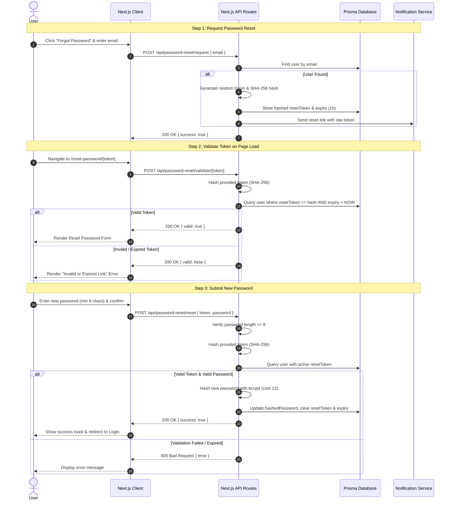

# Password Reset Workflow & Security Policy Documentation

## Overview

This document describes the security policies and architectural workflow for user password management and password reset operations in Jorbites.

## Password Security Policy

1. **Minimum Length**: All user passwords must be at least **8 characters** long.
2. **Storage**: Passwords are hashed using `bcrypt` with a salt round / cost factor of `12` before being persisted to the database.
3. **Reset Tokens**:
   - Reset tokens are generated using cryptographically secure random bytes (`crypto.randomBytes`).
   - Only SHA-256 hashed versions of tokens (`crypto.createHash('sha256')`) are stored in the database.
   - Tokens expire after 1 hour.
4. **Token Validation Route**:
   - Token validation is handled via `POST /api/password-reset/validate/[token]` to prevent CSRF risks and unintended browser prefetching side-effects associated with `GET` requests.

---

## Workflow Diagram

---

## API Endpoints Summary

| Endpoint | Method | Purpose | Rate Limit |
| :--- | :--- | :--- | :--- |
| `/api/register` | `POST` | User registration (enforces min 8 char password) | 5 / 15 min |
| `/api/password-reset/request` | `POST` | Request password reset token via email | 3 / 15 min |
| `/api/password-reset/validate/[token]` | `POST` | Validate reset token validity | 10 / 15 min |
| `/api/password-reset/reset` | `POST` | Complete password reset with new 8+ char password | 3 / 15 min |
| `/api/password/[userId]` | `PATCH` | Authenticated password change (enforces min 8 char new password) | Standard API rate limit |
