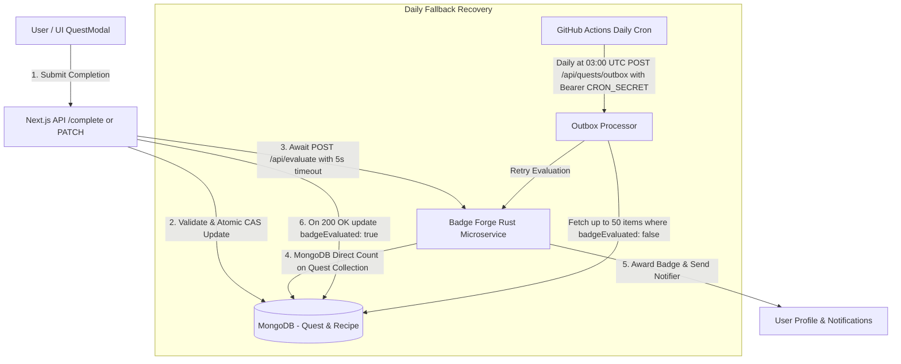
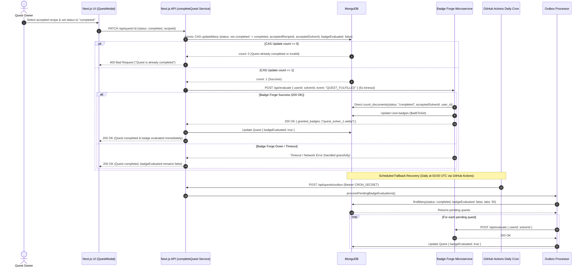

# Quest Fulfillment Badges Architecture & Communication Workflow

This document details the end-to-end architecture, data flow, and communication workflow between the **Jorbites Next.js application**, **MongoDB**, and the **Badge Forge Rust microservice** for evaluating and awarding Quest Fulfillment Badges.

---

## 🏗️ Architecture Overview

When a user completes a community recipe quest, the system selects an accepted recipe submission, atomically locks the quest to prevent race conditions or badge farming, and triggers an immediate evaluation call with a 5s timeout to `Badge Forge`.

---

## 🔄 End-to-End Sequence Diagram

The following Mermaid sequence diagram illustrates the direct evaluation call sequence and the daily fallback recovery path:

---

## 🏅 Badge Tier Thresholds

Badge evaluation in `Badge Forge` counts **distinct completed quests** where `quest.acceptedSolverId` matches the evaluated user directly in the `Quest` collection:

| Badge Identifier | Name | Requirement | Icon Asset |
|---|---|---|---|
| `quest_solver_1.webp` | Bronze Quest Solver | 1 Quest Fulfilled | `/public/badges/quest_solver_1.webp` |
| `quest_solver_10.webp` | Silver Quest Solver | 10 Distinct Quests Fulfilled | `/public/badges/quest_solver_10.webp` |
| `quest_solver_25.webp` | Gold Quest Master | 25 Distinct Quests Fulfilled | `/public/badges/quest_solver_25.webp` |

---

## 🔒 Security & Data Integrity

1. **Atomic Compare-And-Set (CAS)**:
   - Uses `prisma.quest.updateMany({ where: { id: questId, userId: currentUserId, status: { not: 'completed' } }, data: ... })`.
   - Prevents race conditions and guarantees that exactly one completion request can set the accepted solver.
2. **Terminal State & Typo Editing**:
   - Completed quests cannot be reopened to `open` or `in_progress` (returns `400 Bad Request`).
   - However, quest owners may update the `title` and `description` of a completed quest without re-triggering completion or encountering errors.
3. **Outbox Bearer Authentication & Batching**:
   - `/api/quests/outbox` strictly requires `Authorization: Bearer <CRON_SECRET>` authentication. Missing or invalid tokens return `401 Unauthorized`.
   - The processor fetches up to 50 pending quests per batch (`take: 50`) to ensure execution stays well within execution timeout limits.
4. **Resilient HTTP Client**:
   - Outbound requests to `Badge Forge` use an `AbortSignal.timeout(5000)` to ensure hanging sockets or network lag do not block backend processes.
