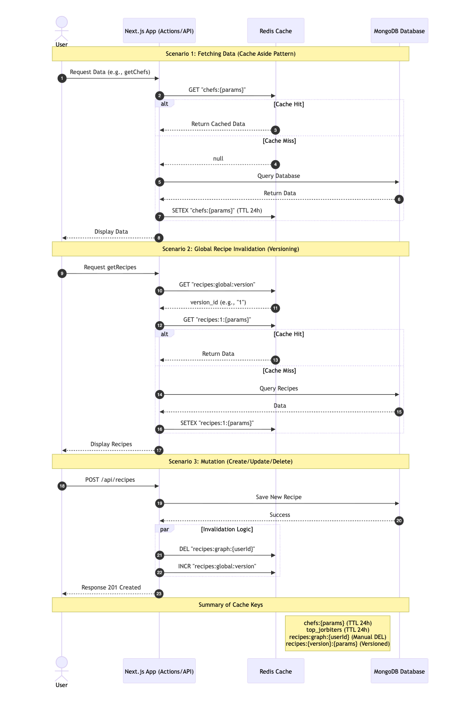

# Redis Caching

This document describes the Redis caching strategy implemented in Jorbites to improve the performance of expensive API calls and data fetching functions.

## Overview

We use a dedicated Redis instance for caching to separate it from other operational data (like rate limiting). This ensures that caching operations do not interfere with critical system functions and allows for independent scaling or configuration.

## How it works

## Configuration

-   **Environment Variable**: `REDIS_URL_CACHING`
    -   This variable must be set in the environment to point to the Redis instance used for caching.
-   **Client**: A separate `Redis` client instance named `redisCache` is exported from `app/lib/redis.ts`.

## Cached Resources

The following data fetching functions are currently cached:

### 1. Chefs List (`getChefs`)
-   **Action**: `app/actions/getChefs.ts`
-   **Cache Key**: `chefs:${JSON.stringify(params)}`
    -   `params` includes search, page, limit, and sort order.
-   **TTL**: 24 hours (86400 seconds).
-   **Invalidation**: Automatic expiration.

### 2. Top Jorbiters (`getTopJorbiters`)
-   **Action**: `app/actions/getTopJorbiters.ts`
-   **Cache Key**: `top_jorbiters`
-   **TTL**: 24 hours.
-   **Invalidation**: Automatic expiration.

### 3. Recipe Contribution Graph (`getRecipesForGraph`)
-   **Action**: `app/actions/getRecipesForGraph.ts`
-   **Cache Key**: `recipes:graph:${userId}`
-   **TTL**: 24 hours (default).
-   **Invalidation**:
    -   **Trigger**: When a user creates or deletes a recipe.
    -   **Mechanism**: The key is explicitly deleted.

### 4. Global Recipes List (`getRecipes`)
-   **Action**: `app/actions/getRecipes.ts`
-   **Cache Key**: `recipes:${version}:${JSON.stringify(params)}`
    -   Uses a global versioning strategy to handle complex query invalidation.
-   **TTL**: 24 hours (default).
-   **Invalidation**:
    -   **Trigger**: Any recipe creation, update, or deletion globally.
    -   **Mechanism**: The global version key `recipes:global:version` is incremented. This effectively invalidates all existing recipe search/list caches as new requests will use the new version number in their keys.

    > **Why `{version}`?**
    > `getRecipes` accepts many combinations of parameters (search, category, page, sorting), creating thousands of potential cache keys. Identifying and deleting only the specific keys affected by a recipe change is computationally expensive and complex.
    > By including a version number in the key, maintaining a simple global counter allows us to instantly "invalidate" all related caches by simply incrementing the version. Old keys are left to naturally expire.

## Invalidation Triggers

The invalidation logic is centralized in the Recipe API routes:

-   **POST /api/recipes** (Create Recipe):
    -   Invalidates user's graph cache (`recipes:graph:${userId}`).
    -   Increments global recipe version (`recipes:global:version`).

-   **PATCH /api/recipe/[recipeId]** (Update Recipe):
    -   Increments global recipe version (`recipes:global:version`).

-   **DELETE /api/recipe/[recipeId]** (Delete Recipe):
    -   Invalidates user's graph cache (`recipes:graph:${userId}`).
    -   Increments global recipe version (`recipes:global:version`).

## Monitoring

You can verify caching behavior by monitoring application logs for the following messages:
-   `cache hit`: Data was served from Redis.
-   `start`: Data is being fetched from the database (cache miss).
