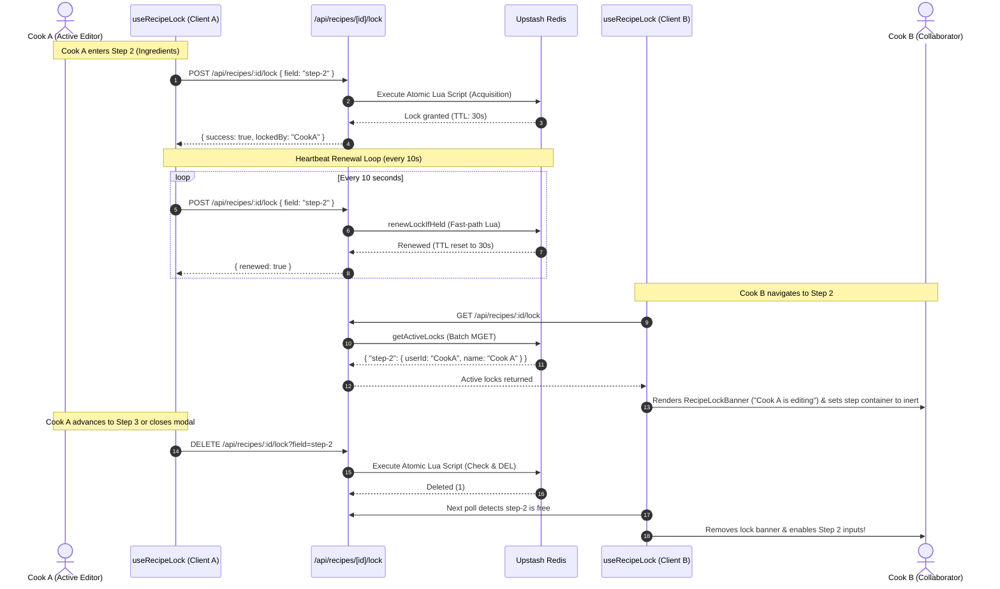

# Redis Soft-Locking in Recipe Collaboration

> A deep dive into how Jorbites implements step-level soft-locking for concurrent recipe editing using Redis, and why Redis is the ideal architecture for this feature.

---

## 1. Overview & Problem Statement

In Jorbites, multiple users can co-author a recipe or collaboratively edit an existing one in real-time. Without concurrency controls, concurrent editing leads to:
- **Last-Write-Wins overwrites**: Cook A updates the ingredients list, while Cook B simultaneously updates the cooking instructions and clicks save, inadvertently wiping Cook A's additions.
- **Form state collision**: Conflicting input values causing UI jitter, race conditions, and corrupted draft payloads.

### Why Not Full Document Locking?
Locking the entire recipe whenever one person is typing would create frustrating bottlenecks: if Cook A is writing the recipe story in Step 1, Cook B should still be free to enter the ingredient measurements in Step 2 or upload photos in Step 4.

### Why Not WebSockets + Operational Transformation (OT) / CRDTs?
Heavyweight collaborative text engines (like Yjs, Automerge, or operational transformations used in Google Docs):
1. **Require stateful, persistent servers**: They do not fit well in a modern serverless deployment (Vercel, Next.js serverless functions) where connections are ephemeral.
2. **Extreme complexity for structured forms**: A recipe is not a single freeform text canvas; it is a structured document with distinct steps, quantities, units, and categories.
3. **High operational cost**: Maintaining WebSocket connection pools and coordinating distributed state is expensive and operationally fragile.

### The Solution: Step-Level Soft-Locking
Jorbites solves this by implementing **step-level soft locks** powered by Redis:
- A recipe draft is divided into distinct sections (*Category, Description, Ingredients, Steps, Images, Related Content*).
- Multiple cooks can open the same draft simultaneously.
- When a user enters a step, they acquire an exclusive lease (lock) for **only that step**.
- Other collaborators can view that step in read-only mode (`inert` HTML attribute guard), while actively editing any other unlocked step.

---

## 2. Architecture & Lifecycle



---

## 3. Technical Implementation Details

The locking system is implemented across three key layers:
1. **Engine Layer** ([`app/lib/redisLock.ts`](../app/lib/redisLock.ts)): Atomic Redis operations and Lua scripts.
2. **API Layer** ([`app/api/recipes/[id]/lock/route.ts`](../app/api/recipes/[id]/lock/route.ts)): HTTP endpoints, authentication, and permission verification.
3. **Client Hook** ([`app/hooks/useRecipeLock.ts`](../app/hooks/useRecipeLock.ts)): React hook managing lifecycle, heartbeats, polling, and UI disabling.

### A. Key Format & Payload
Every soft-lock is stored in Redis under an isolated, predictable key pattern:
```text
lock:recipe:<targetId>:field:<fieldKey>
```
- `<targetId>`: The recipe ID or draft ID.
- `<fieldKey>`: The active step identifier (e.g., `step-0`, `step-1`, `step-2`).

**Payload Structure:**
```json
{
  "userId": "usr_789xyz",
  "userName": "Ana Rossi",
  "userAvatar": "https://cloudinary.com/.../avatar.jpg",
  "timestamp": 1725432000000
}
```

### B. Atomic Acquisition (Preventing Race Conditions)
If two users click into Step 2 at the exact same millisecond, a standard `GET` followed by `SET` would suffer from a **Time-Of-Check to Time-Of-Use (TOCTOU)** race condition.

To prevent this, `acquireLock` executes an atomic **Lua script**:
```lua
local val = redis.call("GET", KEYS[1])
if not val then
    -- Lock is free: acquire immediately
    redis.call("SET", KEYS[1], ARGV[1], "EX", ARGV[2])
    return {1, ARGV[3], ARGV[4], ARGV[5]}
end

local ok, data = pcall(cjson.decode, val)
local lockUser = (ok and data and data.userId) or val

if lockUser == ARGV[3] then
    -- Already held by this user: extend lease
    redis.call("SET", KEYS[1], ARGV[1], "EX", ARGV[2])
    return {1, ARGV[3], ARGV[4], ARGV[5]}
else
    -- Held by someone else: return lock holder's metadata
    return {0, lockUser, data and data.userName or "", data and data.userAvatar or ""}
end
```
Because Redis executes Lua scripts as a single atomic unit, no other operation can interleave.

### C. Fast-Path Heartbeat Renewal
- **TTL Duration**: 30 seconds (`LOCK_TTL_SECONDS = 30`).
- **Heartbeat Interval**: 10 seconds (`LOCK_HEARTBEAT_INTERVAL_MS = 10000`).

While a cook is actively working on a step, their client sends a heartbeat every 10 seconds. In [`app/api/recipes/[id]/lock/route.ts`](../app/api/recipes/[id]/lock/route.ts), incoming requests first check:
```typescript
const renewResult = await renewLockIfHeld(
    targetId,
    field,
    currentUser.id,
    currentUser.name,
    currentUser.image
);
if (renewResult.renewed) {
    return NextResponse.json(renewResult.lockResult);
}
```
`renewLockIfHeld` runs a single Redis Lua command that verifies ownership and resets the 30-second expiry. **It bypasses MongoDB completely**, making heartbeat renewals execute in **< 2 milliseconds** without consuming primary database connections.

### D. Safe Atomic Deletion
When a user finishes a step or navigates away, the client issues a `DELETE` request. A naive `redis.del(key)` could introduce a bug: if a user's network lagged, their lock expired, and another user acquired it, an unrestricted `del` would release the *new* owner's lock!

The release logic uses an atomic check-and-delete Lua script:
```lua
local val = redis.call("GET", KEYS[1])
if not val then return 1 end
local ok, data = pcall(cjson.decode, val)
if ok and data and data.userId == ARGV[1] then
    return redis.call("DEL", KEYS[1])
else
    return 0
end
```
The key is only deleted if the caller is still the verified owner.

### E. Scalable Multi-Lock Discovery (`getActiveLocks`)
Instead of issuing individual `GET` requests for every step (causing N+1 network requests), `getActiveLocks`:
1. Discovers active locks using non-blocking `SCAN` (avoiding the production danger of blocking `KEYS *` commands).
2. Executes a single batch `MGET` across all matching keys.
3. Maps keys into a concise dictionary of active locks returned to the UI.

### F. Client UX & the `inert` Attribute
When another user holds a lock:
1. **Activity Banner**: [`RecipeLockBanner.tsx`](../app/components/modals/recipe-steps/RecipeLockBanner.tsx) renders an amber notice showing the avatar and name of the collaborator currently working on that step.
2. **Input Guarding**: The active step container receives the HTML standard **`inert`** attribute. Unlike simply disabling individual input fields, `inert`:
   - Disables all form controls, buttons, and custom widgets inside the container.
   - Removes the container from the browser tab order.
   - Prevents screen readers and pointer events from interacting with the locked section.
3. **Freedom to Navigate**: The wizard header and other steps remain fully interactive, allowing the user to navigate to unlocked sections.

---

## 4. Why Redis is the Perfect Fit

| Requirement | Relational / Document DB (PostgreSQL, MongoDB) | Stateful Sockets / CRDT Server | Redis (Upstash) |
|---|---|---|---|
| **Latency & Throughput** | 30–80 ms per operation. Heartbeats create high write amplification on disk and transaction logs. | < 1 ms in memory, but requires managing persistent connection pools. | **1–3 ms**. Pure in-memory operations with negligible CPU impact. |
| **Handling Crashes / Disconnects** | **High risk of deadlocks**: If a user closes their laptop or loses connection, custom cron jobs or TTL index sweeps are required to reap abandoned locks. | Requires complex ping/pong heartbeats and cluster disconnect handlers. | **Native Engine TTL**: Key automatically vanishes after 30 seconds. Zero orphaned locks, zero deadlocks, zero cleanup scripts. |
| **Concurrency & Atomicity** | Requires database row locks, table locks, or optimistic revision checks that can deadlock under high contention. | Requires distributed consensus algorithms. | **Single-threaded event loop + Lua**: Guarantees true serializability with zero locking overhead on the server. |
| **Serverless Compatibility** | Database connection pooling bottlenecks on serverless Lambdas/Edge functions. | **Incompatible** with stateless serverless functions (requires standing servers like Node or Elixir). | **Serverless-native**: Connects via HTTP/REST or managed TCP connection pooling effortlessly from serverless API routes. |
| **Operational Overhead** | Clutters primary database with high-frequency ephemeral data that must be regularly pruned. | High cost and ops burden to maintain, scale, and monitor dedicated socket infrastructure. | Zero-maintenance managed service (Upstash) with negligible memory footprint. |

---

## 5. Security Protections

1. **Authorization Verification**:
   - Before a user can acquire a lock on a draft or recipe, `/api/recipes/[id]/lock` validates that the caller is either the recipe `owner` or a member of the authorized `coCooksIds` roster.
2. **Key Injection Prevention (Glob Escaping)**:
   - When clearing locks on modal close or publish (`releaseAllLocks`), user-supplied IDs are escaped against glob special characters (`*`, `?`, `[`, `]`) to prevent unintended multi-key deletion.
3. **Payload Sanitization**:
   - Only non-sensitive display properties (`userId`, `userName`, `userAvatar`, `timestamp`) are serialized into the lock payload.

---

## 6. Summary

Step-level soft-locking via Redis strikes the ideal balance for collaborative recipe management:
- **For Users**: A smooth, collision-free collaborative experience where multiple cooks can work on different parts of the same recipe simultaneously without destroying each other's work.
- **For the System**: Ephemeral locking traffic is completely decoupled from MongoDB, locks clean themselves up automatically on disconnection, and the entire stack remains 100% serverless-friendly.
