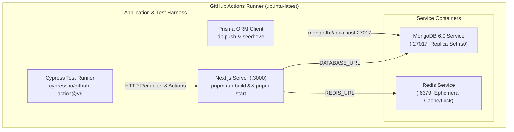
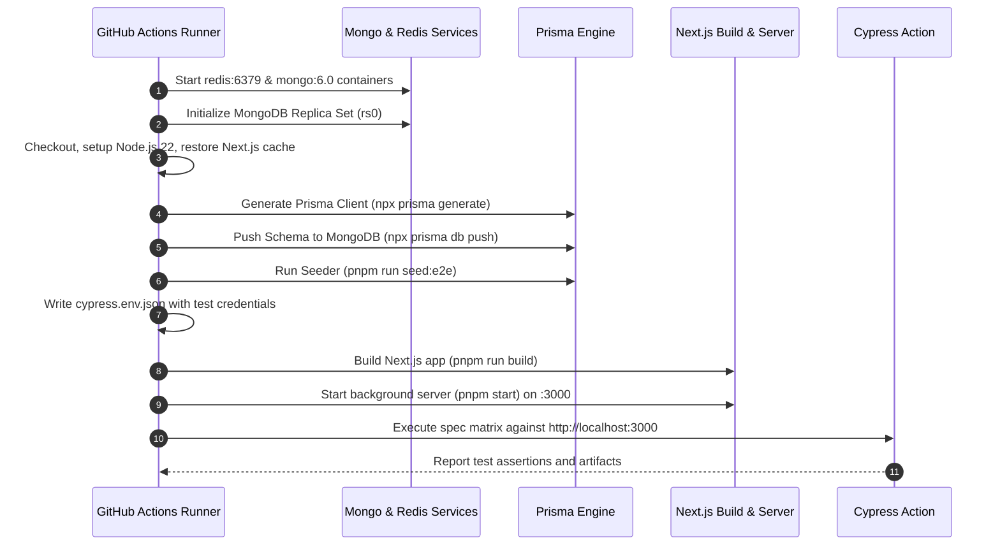

# Cypress E2E CI Configuration & Architecture

This document provides a comprehensive guide and architectural overview of the **Cypress End-to-End (E2E) Continuous Integration (CI)** pipeline in **Jorbites**, configured in [`.github/workflows/cypress.yml`](file:///.github/workflows/cypress.yml).

---

## 1. Executive Summary

The Jorbites E2E testing pipeline runs fully self-contained on GitHub Actions using parallel matrix containers. Each matrix job provisions its own **Local MongoDB (Replica Set)** and **Local Redis** service containers, ensuring:

- **Zero External Dependencies**: Tests do not rely on remote staging or production databases.
- **Complete Test Isolation**: Parallel test jobs cannot cause race conditions or state pollution between each other.
- **Deterministic Seeding**: Clean baseline fixtures and test credentials are automatically provisioned before test execution.

---

## 2. Infrastructure & Service Containers

Each runner in the matrix boots two dedicated service containers directly on the runner host:



### 2.1 Local MongoDB Service (`mongo:6.0`)

- **Port**: `27017`
- **Replica Set Configuration**: Prisma ORM with MongoDB strictly requires a Replica Set for transaction and multi-document operation support. The runner starts the container with `--replSet rs0` and initiates `rs0`:
    ```bash
    docker run -d --name mongodb -p 27017:27017 mongo:6.0 mongod --replSet rs0 --bind_ip_all
    until docker exec mongodb mongosh --eval 'db.adminCommand("ping")' > /dev/null 2>&1; do
      sleep 1
    done
    docker exec mongodb mongosh --eval 'rs.initiate({_id: "rs0", members: [{_id: 0, host: "localhost:27017"}]})'
    ```
- **Connection URL**:
  `mongodb://localhost:27017/jorbites-test?replicaSet=rs0&directConnection=true`

### 2.2 Local Redis Service (`redis:alpine`)

- **Port**: `6379`
- **Role**: Backs ephemeral collaborative drafts (`/api/draft`), section distributed soft-locking (`/api/draft/lock`), active collaborator activity tracking, and rate limiting.
- **Connection URL**:
  `redis://localhost:6379`

---

## 3. Automated Database Seeding (`prisma/seed-e2e.ts`)

Before Cypress launches the Next.js server, the database schema is pushed and seeded with deterministic test fixtures:

```bash
npx prisma db push --skip-generate
pnpm run seed:e2e
```

### Seeded Fixtures:

1. **Primary Cypress Test User**:
    - **Email**: Defined by `CYPRESS_USER_EMAIL` (default: `test@jorbites.com`).
    - **Password**: Bcrypt-hashed from `CYPRESS_USER_PASSWORD` (default: `password123`).
    - **Language**: English (`en`).
    - **Verification & Level**: Level 1 verified user.
2. **Collaborator Chefs**:
    - Six synthetic chefs (`Chef Maria`, `Chef One`, `Chef Two`, `Chef Three`, `Chef Four`, `Chef Five`) used to test collaborator autocomplete dropdowns, co-cook invitations, and capacity limit assertions (`MAX_CO_COOKS = 4`).

---

## 4. CI Matrix Sharding Strategy

The test suite is divided across **5 parallel matrix containers** to optimize execution time and resource utilization:

| Container | Name                             | Spec Files                                                                                                                | Primary Focus Areas                                                                          |
| :-------- | :------------------------------- | :------------------------------------------------------------------------------------------------------------------------ | :------------------------------------------------------------------------------------------- |
| **1**     | `Recipes Spec`                   | [`basic.cy.ts`](file:///__tests__/e2e/basic.cy.ts)                                                                        | Full recipe creation, liking, unliking, commenting, comment deletion, editing, and deletion. |
| **2**     | `Workshops & Quests Specs`       | [`workshops.cy.ts`](file:///__tests__/e2e/workshops.cy.ts)<br/>[`quests.cy.ts`](file:///__tests__/e2e/quests.cy.ts)       | Workshop and quest creation, editing, participation, and deletion lifecycles.                |
| **3**     | `User & Basic Specs`             | [`user.cy.ts`](file:///__tests__/e2e/user.cy.ts)<br/>[`app.cy.ts`](file:///__tests__/e2e/app.cy.ts)                       | NextAuth session login/logout flows and core layout/shell component verification.            |
| **4**     | `Collaborative Recipes`          | [`collaborative_recipes.cy.ts`](file:///__tests__/e2e/collaborative_recipes.cy.ts)                                        | Multi-user co-cooking, invite links, Redis draft syncing, soft-locking, and capacity limits. |
| **5**     | `Drafts Management & Navigation` | [`drafts_management.cy.ts`](file:///__tests__/e2e/drafts_management.cy.ts)<br/>[`drafts_navigation.cy.ts`](file:///__tests__/e2e/drafts_navigation.cy.ts) | Multi-draft modal dashboard, auto-load on open, indicator dot, TTL, duplication, and deletion. |

---

## 5. Step-by-Step CI Execution Flow



---

## 6. Environment Variables & Secrets Reference

The CI workflow uses the following configuration:

| Variable                            | Source / Default                                                               | Purpose                                                              |
| :---------------------------------- | :----------------------------------------------------------------------------- | :------------------------------------------------------------------- |
| `DATABASE_URL`                      | `mongodb://localhost:27017/jorbites-test?replicaSet=rs0&directConnection=true` | MongoDB connection string with replica set support.                  |
| `REDIS_URL`                         | `redis://localhost:6379`                                                       | Ephemeral draft and distributed lock Redis store.                    |
| `REDIS_URL_CACHING`                 | `redis://localhost:6379`                                                       | Cache Redis store.                                                   |
| `CYPRESS_USER_EMAIL`                | `${{ secrets.CYPRESS_USER_EMAIL }}` / `test@jorbites.com`                      | User email for `cy.login()`.                                         |
| `CYPRESS_USER_PASSWORD`             | `${{ secrets.CYPRESS_USER_PASSWORD }}` / `password123`                         | User password for `cy.login()`.                                      |
| `NEXTAUTH_SECRET`                   | `${{ secrets.NEXTAUTH_SECRET }}` / Fallback secret                             | NextAuth JWT and session encryption secret.                          |
| `NEXT_PUBLIC_SKIP_IMAGE_VALIDATION` | `'true'`                                                                       | Allows synthetic test images in Cloudinary uploads.                  |
| `SKIP_ENV_VALIDATION`               | `'true'`                                                                       | Bypasses non-critical third-party production environment validation. |

---

## 7. Running E2E Tests Locally

Developers can replicate the CI setup locally with the following steps:

1. **Start Local Services (Docker)**:

    ```bash
    # Start Redis
    docker run -d --name jorbites-redis -p 6379:6379 redis:alpine

    # Start MongoDB with Replica Set
    docker run -d --name jorbites-mongo -p 27017:27017 mongo:6.0 --replSet rs0 --bind_ip_all
    sleep 2
    docker exec jorbites-mongo mongosh --eval 'rs.initiate({_id: "rs0", members: [{_id: 0, host: "localhost:27017"}]})'
    ```

2. **Seed Local Database**:

    ```bash
    DATABASE_URL="mongodb://localhost:27017/jorbites-test?replicaSet=rs0&directConnection=true" npx prisma db push
    DATABASE_URL="mongodb://localhost:27017/jorbites-test?replicaSet=rs0&directConnection=true" pnpm run seed:e2e
    ```

3. **Run Cypress**:
    ```bash
    pnpm run dev
    # In another terminal:
    pnpm run cypress:open
    ```
