# End-to-End (E2E) Test Workflows Documentation

This document provides architectural and behavioral sequence/flow diagrams for all End-to-End (E2E) test suites in **Jorbites**, with special focus on multi-user collaborative editing backed by local Redis, step synchronization, and GitHub Actions CI matrix execution.

---

## E2E Test Suite Overview & CI Matrix

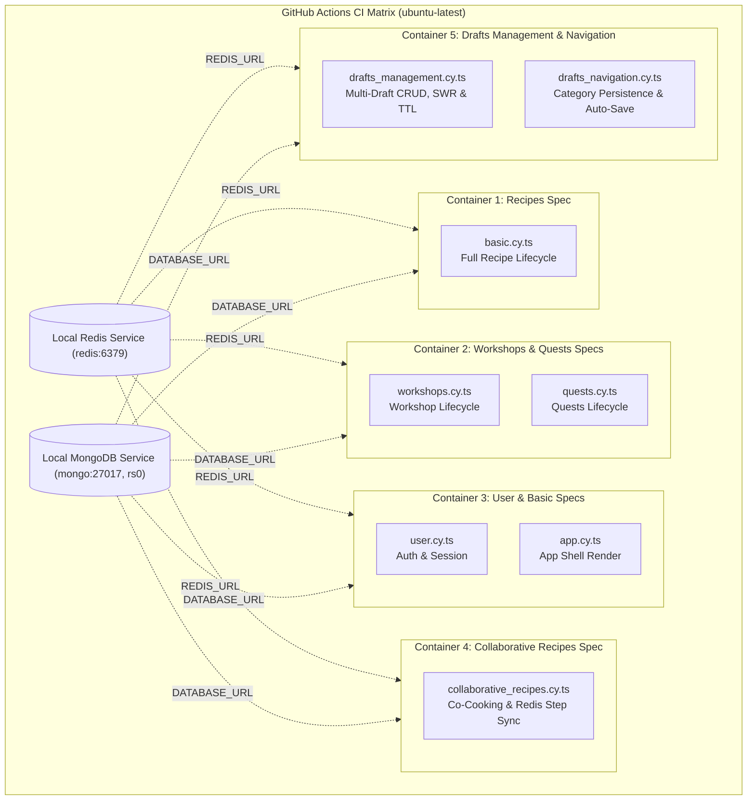

---

## 1. Collaborative Recipes & Step Sync Workflow (`collaborative_recipes.cy.ts`)

This spec validates multi-user co-authoring, tokenized invite links, Redis draft storage, non-destructive step synchronization on forward/back navigation, section soft-locking, and collaborative publishing.

### 1.1 Multi-User Lifecycle & Invite Link Flow

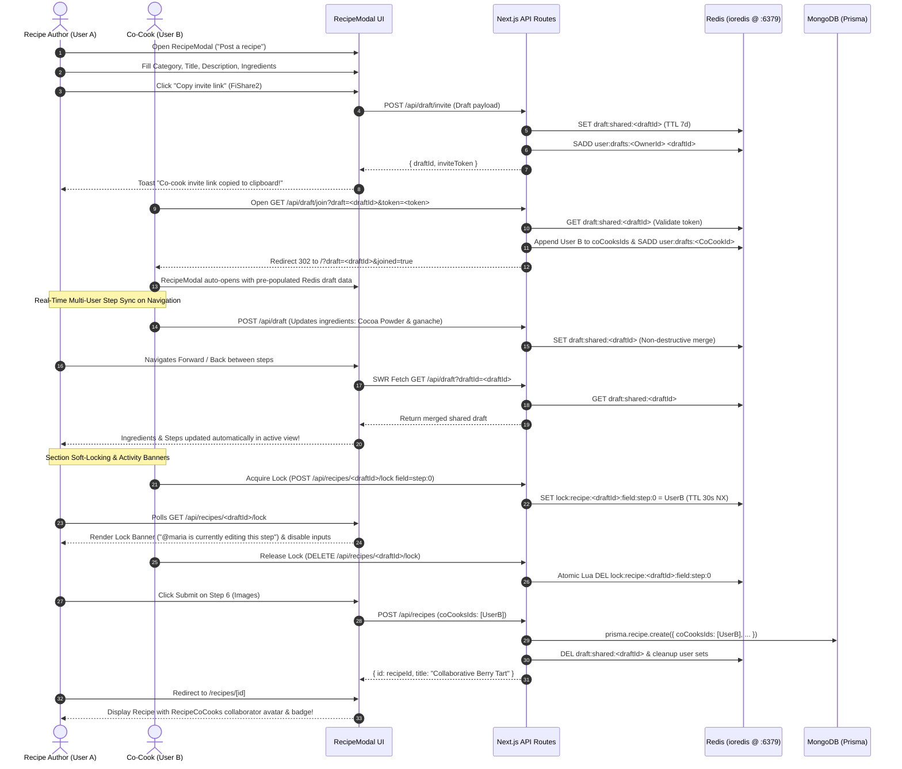

### 1.2 Step Forward/Back Navigation Sync Flow

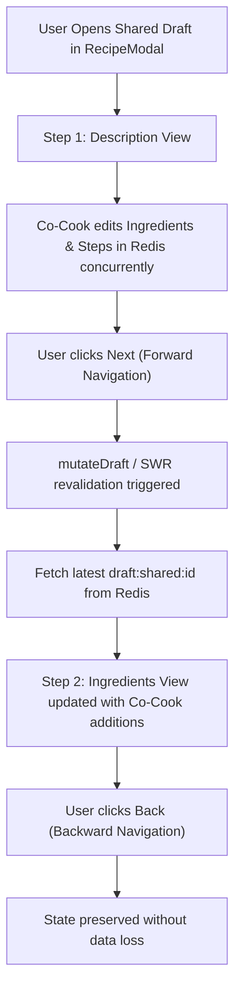

### 1.3 Concurrent Multi-Field Merge & Race Condition Resolution

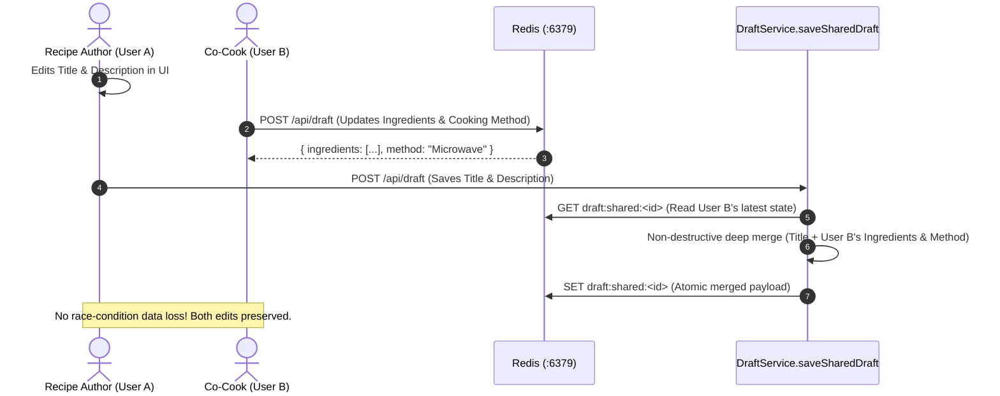

### 1.4 Collaborator Capacity (MAX_CO_COOKS = 4) & Publish Cleanup

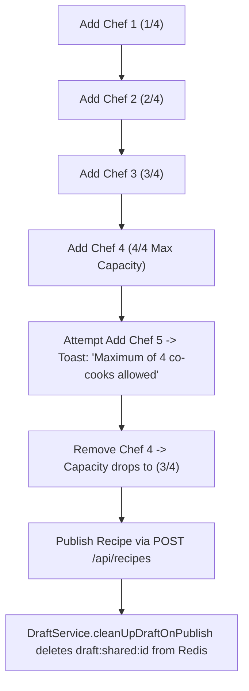

---

## 2. Recipe Lifecycle Workflow (`basic.cy.ts`)

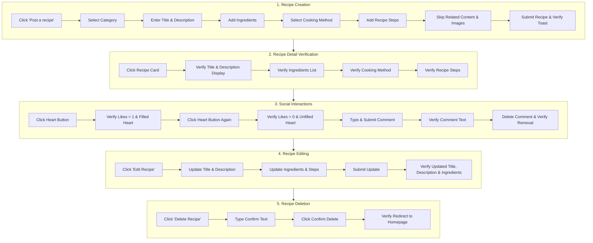

---

## 3. I Cooked This Remakes & Photo Proof Workflow (`cooked_remake.cy.ts`)

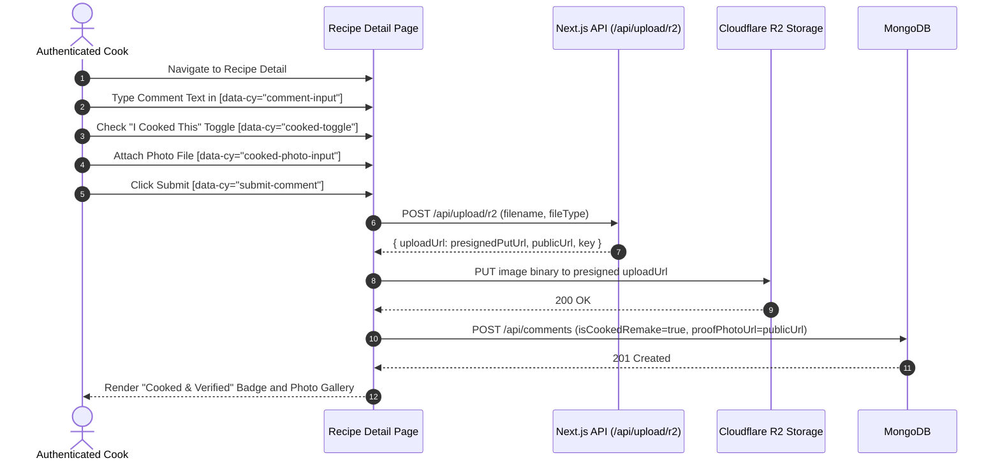

---

## 4. Workshops Lifecycle Workflow (`workshops.cy.ts`)

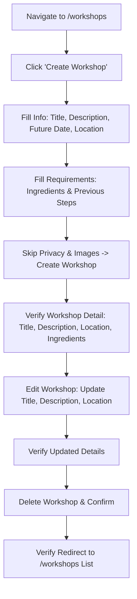

---

## 5. Quests Lifecycle Workflow (`quests.cy.ts`)

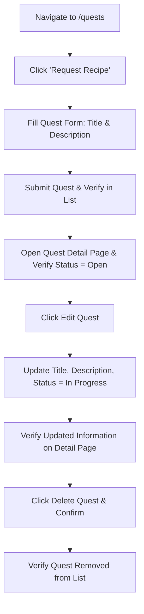

---

## 6. User Authentication & Session Workflow (`user.cy.ts`)

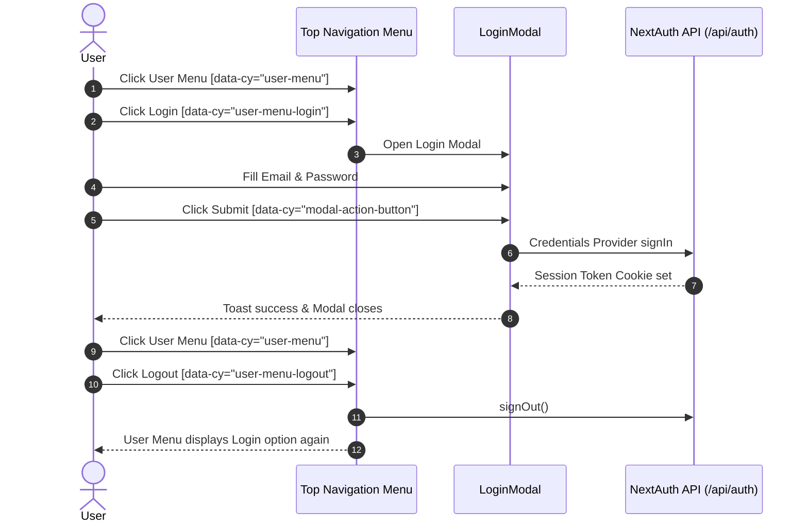

---

## 7. App Shell & Layout Workflow (`app.cy.ts`)

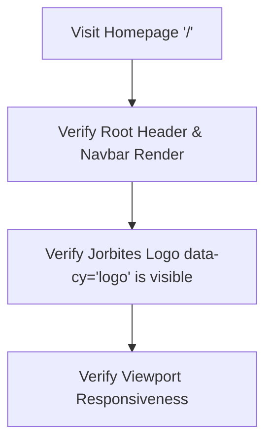

---

## 8. Drafts Management & Multi-Draft Lifecycle (`drafts_management.cy.ts`)

This spec validates the complete multi-draft lifecycle: empty state in `DraftsModal`, creating and auto-saving solo drafts, indicator dot activation in `RecipeModal`, switching to `DraftsModal` from within the recipe wizard, duplicating drafts, and safely deleting drafts with confirmation.

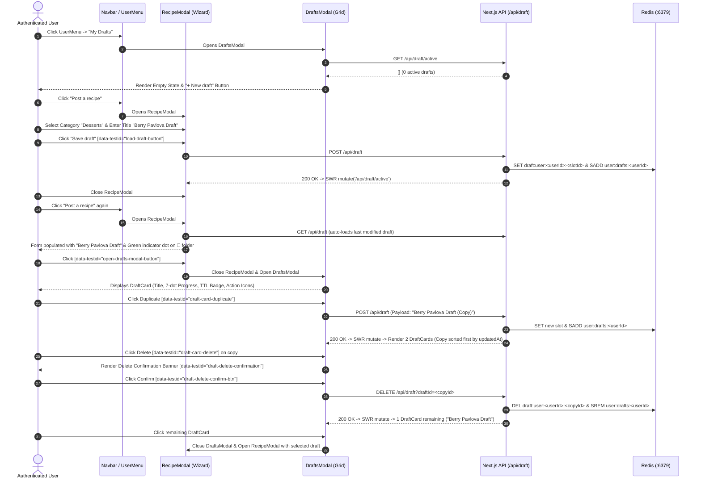

---

## 9. Drafts Navigation & Auto-Save Wizard Persistence (`drafts_navigation.cy.ts`)

This spec validates step-by-step navigation auto-save, category multi-select preservation across re-opening, input modes (plain text vs. multi-row dynamic inputs), and draft data integrity during wizard transitions.

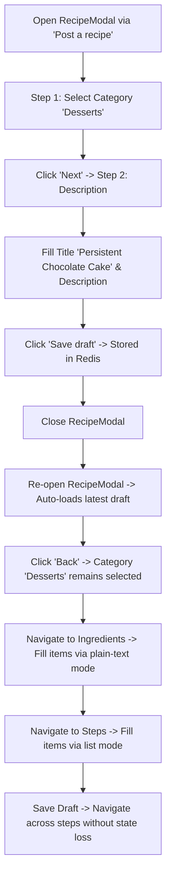
