# End-to-End (E2E) Test Workflows Documentation

This document provides architectural and behavioral sequence/flow diagrams for all End-to-End (E2E) test suites in **Jorbites**, with special focus on multi-user collaborative editing backed by local Redis, step synchronization, and GitHub Actions CI matrix execution.

---

## E2E Test Suite Overview & CI Matrix

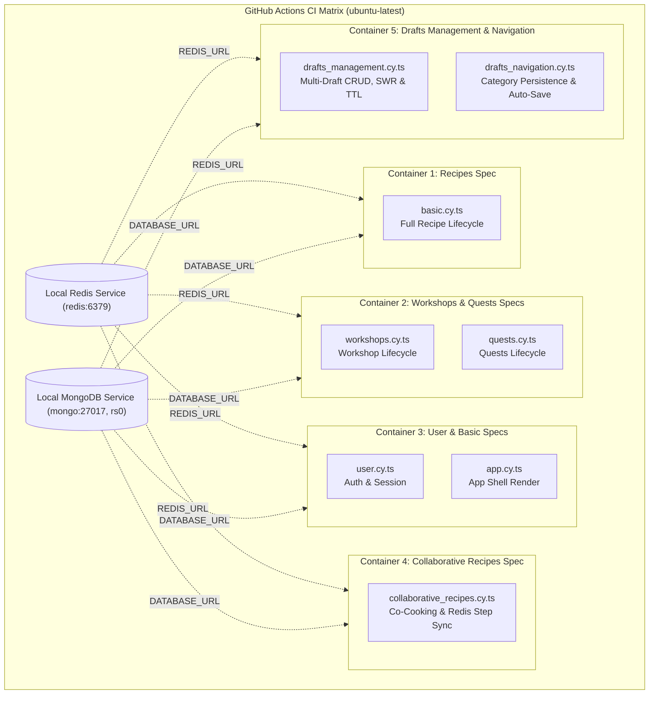

---

## 1. Collaborative Recipes & Step Sync Workflow (`collaborative_recipes.cy.ts`)

This spec validates multi-user co-authoring, tokenized invite links, Redis draft storage, non-destructive step synchronization on forward/back navigation, section soft-locking, and collaborative publishing.

### 1.1 Multi-User Lifecycle & Invite Link Flow

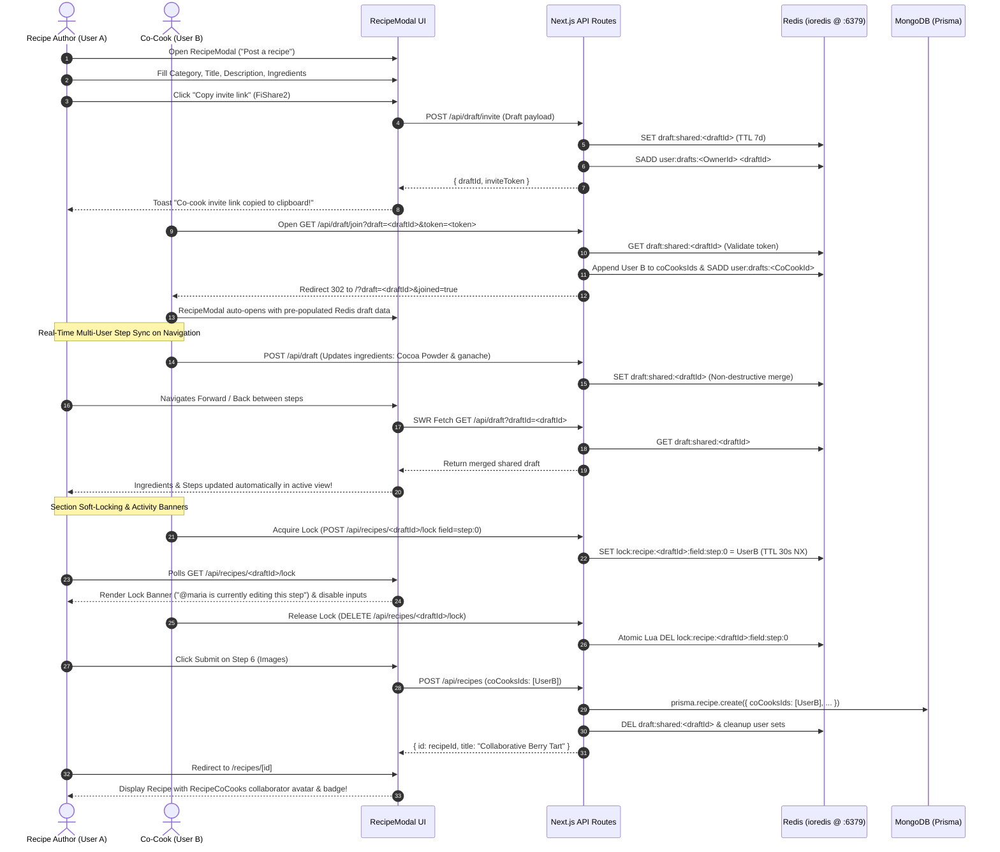

### 1.2 Step Forward/Back Navigation Sync Flow

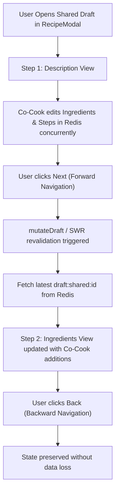

### 1.3 Concurrent Multi-Field Merge & Race Condition Resolution

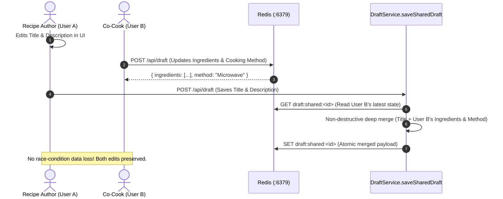

### 1.4 Collaborator Capacity (MAX_CO_COOKS = 4) & Publish Cleanup

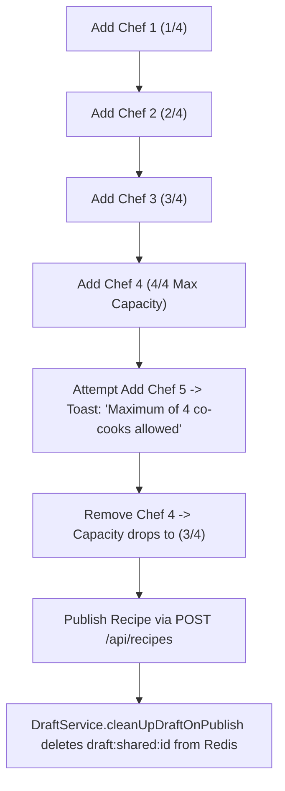

### 1.5 Live UI In-Progress Edit Protection during Co-Cooking

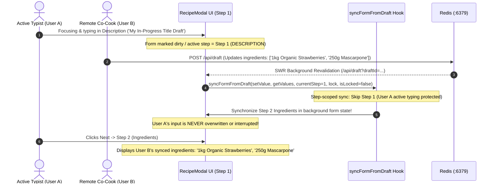

### 1.6 Step Soft-Locking Input Guard & Navigation

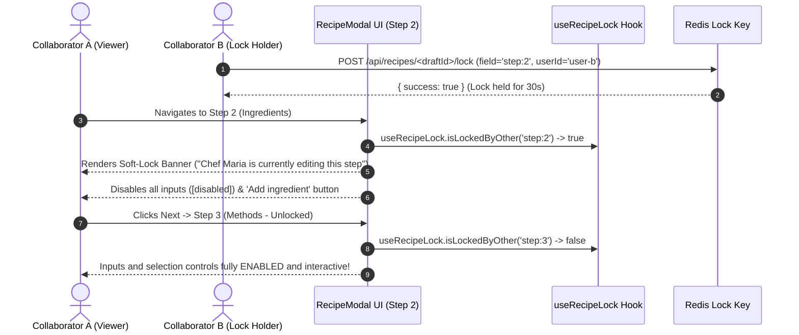

### 1.7 Live Soft-Lock Auto-Recovery on Lock Release

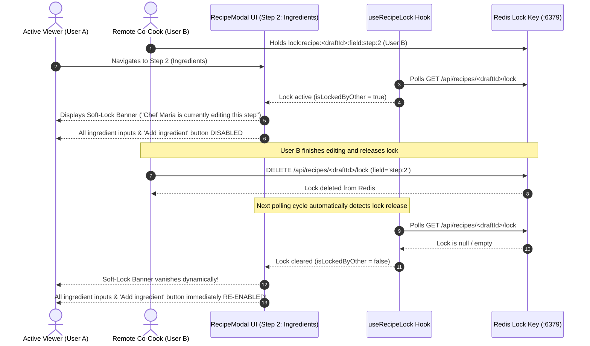

### 1.8 Dynamic Row Expansion on Remote Co-Cook Additions

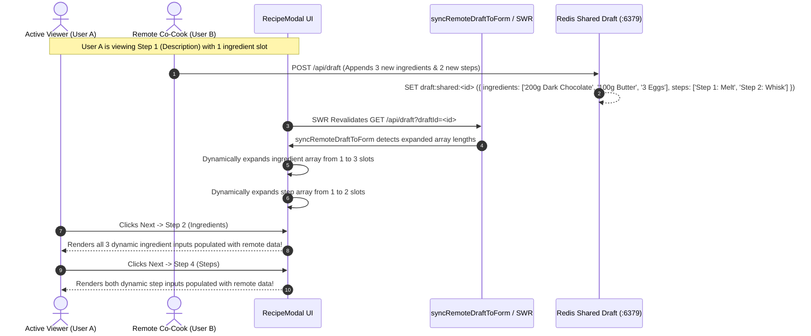

### 1.9 Atomic Co-Cook Join & Quota Enforcement Workflow (Test 12)

This workflow validates that co-cook join requests use an atomic Redis Lua script (`JOIN_SHARED_DRAFT_SCRIPT`) to prevent TOCTOU race conditions and strictly enforce the `MAX_CO_COOKS = 4` limit under high concurrency.

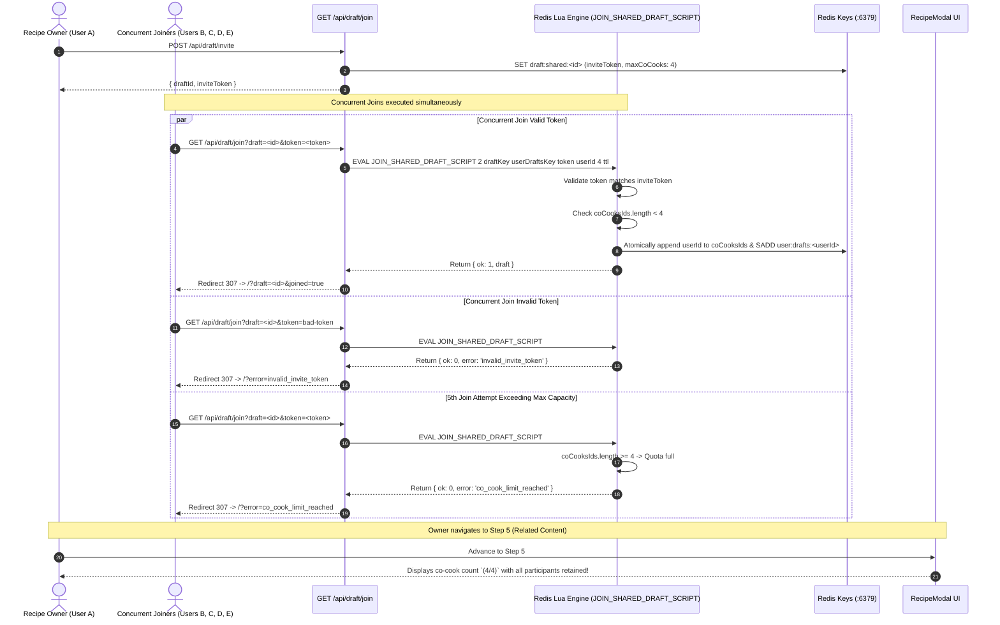

---

## 2. Recipe Lifecycle Workflow (`basic.cy.ts`)

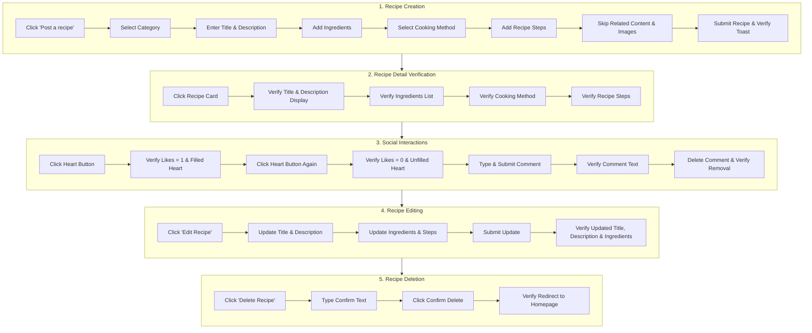

---

## 3. I Cooked This Remakes & Photo Proof Workflow (`cooked_remake.cy.ts`)

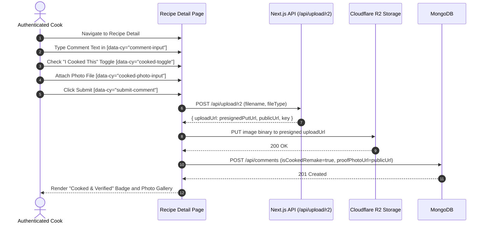

---

## 4. Workshops Lifecycle Workflow (`workshops.cy.ts`)

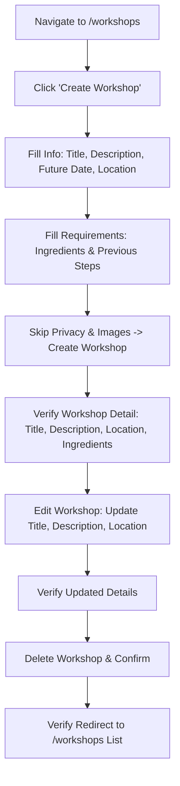

---

## 5. Quests Lifecycle Workflow (`quests.cy.ts`)

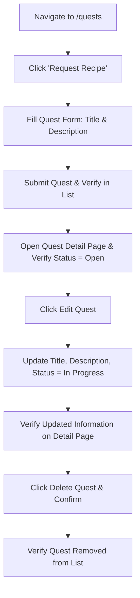

---

## 6. User Authentication & Session Workflow (`user.cy.ts`)

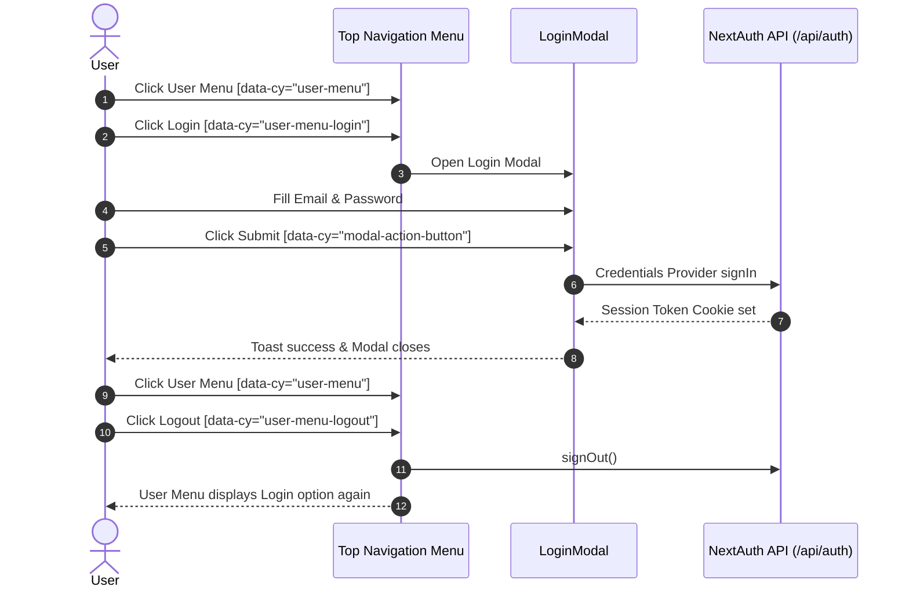

---

## 7. App Shell & Layout Workflow (`app.cy.ts`)

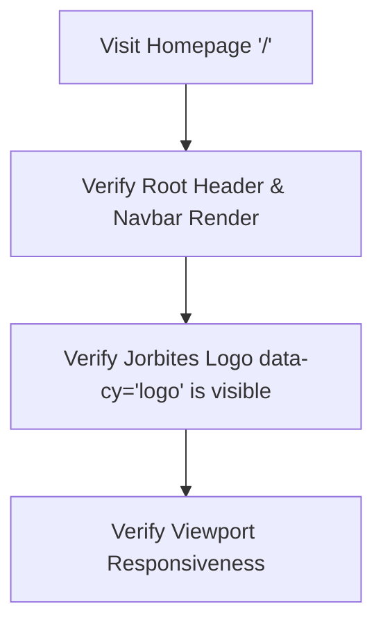

---

## 8. Drafts Management & Multi-Draft Lifecycle (`drafts_management.cy.ts`)

This spec validates the complete multi-draft lifecycle: empty state in `DraftsModal`, creating and auto-saving solo drafts, indicator dot activation in `RecipeModal`, switching to `DraftsModal` from within the recipe wizard, duplicating drafts, safely deleting drafts with confirmation, switching between distinct drafts without form state leakage, full recipe state capture across multi-step wizard navigation, solo draft cleanup upon publishing, and maximum slot limit enforcement (`MAX_SOLO_DRAFT_SLOTS = 5`).

### 8.1 Multi-Draft Lifecycle, Duplication & Deletion Flow

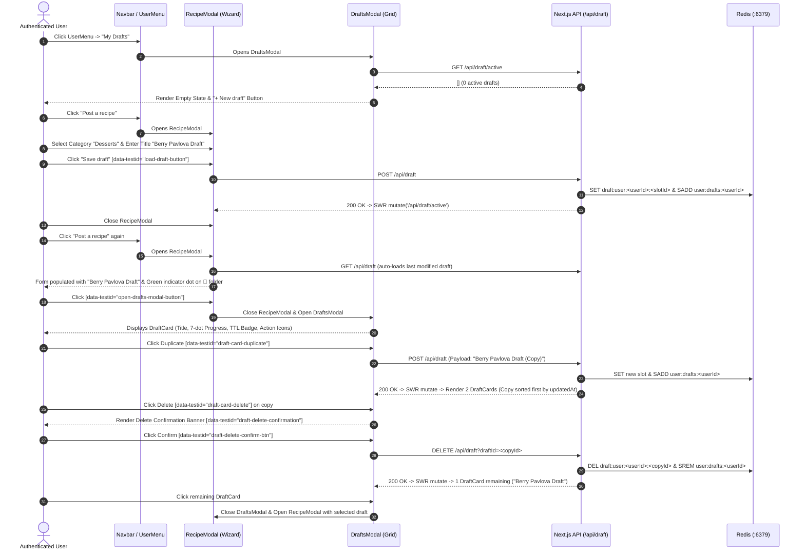

### 8.2 Full Multi-Step State Persistence Across Wizard Steps

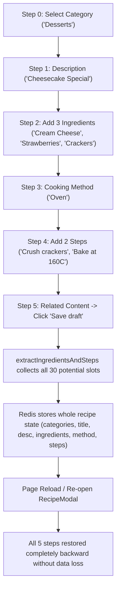

### 8.3 In-Session Draft Switching & Form State Isolation

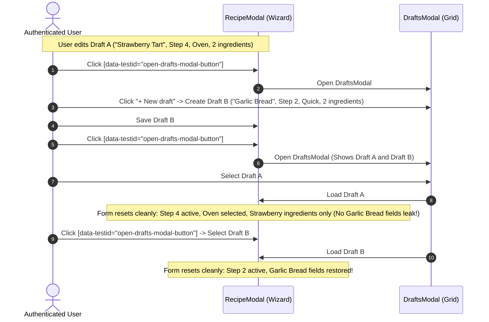

### 8.4 Solo Draft Cleanup on Recipe Publish

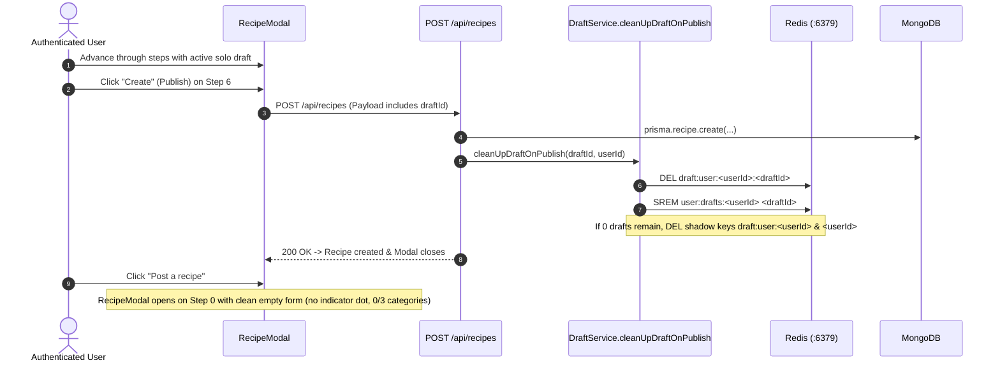

### 8.5 Maximum Solo Draft Slots Limit Enforcement (`MAX_SOLO_DRAFT_SLOTS = 5`)

```mermaid
flowchart TD
    D1["Draft 1"] --> Dup1["Duplicate -> Drafts: 2/5"]
    Dup1 --> Dup2["Duplicate -> Drafts: 3/5"]
    Dup2 --> Dup3["Duplicate -> Drafts: 4/5"]
    Dup3 --> Dup4["Duplicate -> Drafts: 5/5 (Max Capacity)"]
    Dup4 --> Attempt6["Attempt 6th Duplicate -> POST /api/draft"]
    Attempt6 --> Reject["API returns 409 Conflict: 'MAX_SOLO_DRAFTS_REACHED'"]
    Reject --> Toast["UI shows limit warning; Card count stays at 5"]
    Toast --> DeleteOne["Delete 1 Draft -> Capacity drops to 4/5"]
    DeleteOne --> DupAllowed["Duplicate now succeeds -> Returns to 5/5"]
```

### 8.6 Mixed Solo & Collaborative Drafts Grid (`DraftsModal`)

```mermaid
flowchart TD
    SD["Create Solo Draft ('Solo Truffle Pasta')"] --> Dup["Duplicate -> 2 Draft Slots"]
    Dup --> Conv["Convert 1st Draft to Collaborative via Share Button"]
    Conv --> Token["POST /api/draft/invite -> Generates Invite Token & Sets Type='shared'"]
    Token --> Grid["DraftsModal Grid Renders Mixed Draft Cards:"]
    Grid --> C1["Card 1: 'Shared' Badge | 7d TTL | Invite Share Action"]
    Grid --> C2["Card 2: 'Solo' Badge | 365d TTL | Standard Solo Actions"]
    C2 --> OpenSolo["Select Solo Draft -> Loads 'Solo Truffle Pasta' cleanly in RecipeModal"]
```

### 8.7 Plain-Text Parser Persistence Across Draft Save & Page Reload

```mermaid
sequenceDiagram
    autonumber
    actor User as Authenticated User
    participant RM as RecipeModal
    participant PTP as Text Parser
    participant API as POST /api/draft
    participant Redis as Redis (:6379)

    User->>RM: Step 2 (Ingredients) -> Toggle Plain-Text Mode
    User->>RM: Paste numbered items ('1. 200g Dark Chocolate\n2. 100g Butter\n...')
    User->>RM: Click 'Apply'
    PTP-->>RM: Populates individual slots (ingredient-0, ingredient-1, etc.)
    User->>RM: Step 4 (Steps) -> Toggle Plain-Text Mode & Apply steps
    User->>RM: Step 5 -> Click 'Save draft'
    RM->>API: POST /api/draft (Whole recipe state extracted)
    API->>Redis: Saved to user slot
    User->>User: Hard page reload (F5 / cy.reload())
    User->>RM: Click 'Post a recipe'
    RM->>API: GET /api/draft
    API-->>RM: Complete draft data
    Note over RM: Step backwards: Step 4 (3 steps), Step 3 (Oven), Step 2 (4 ingredients), Step 1 (Title) all intact!
```

### 8.8 Intentional Empty Array Clearing & Persistence

```mermaid
sequenceDiagram
    autonumber
    actor User as Authenticated User
    participant RM as RecipeModal (Wizard)
    participant API as POST /api/draft
    participant Redis as Redis (:6379)

    User->>RM: Create draft with Ingredients ('Vanilla Extract', 'Whole Milk') & Save
    RM->>API: POST /api/draft (ingredients: ['Vanilla Extract', 'Whole Milk'])
    API->>Redis: Persists draft in slot
    User->>RM: Navigate to Ingredients Step & explicitly clear all input fields
    User->>RM: Click 'Save draft'
    RM->>API: POST /api/draft (ingredients: [])
    API->>Redis: Overwrites ingredients array with [] (does not restore old items)
    User->>User: Hard page reload (cy.reload())
    User->>RM: Re-open RecipeModal -> Navigate to Ingredients
    Note over RM: Ingredients remain empty [] without ghost item restoration!
```

### 8.9 In-Flight Save Queue & Modal Transition

```mermaid
sequenceDiagram
    autonumber
    actor User as Authenticated User
    participant RM as RecipeModal
    participant DM as DraftsModal
    participant Hook as useDraftPersistence (saveQueueRef)
    participant API as POST /api/draft

    User->>RM: Fill Title ('In-Flight Save Test') on Step 1
    User->>RM: Immediately click 'My Drafts' header button (without clicking Save)
    RM->>Hook: flushDraftSaves() initiates & awaits pending queue
    Hook->>API: POST /api/draft
    API-->>Hook: 200 OK (draft saved)
    RM->>DM: Opens DraftsModal
    DM-->>User: Displays DraftCard with updated title ('In-Flight Save Test')!
```

### 8.10 Rapid Keystroke Autosave Queue & Step Navigation

```mermaid
sequenceDiagram
    autonumber
    actor User as Fast Typist
    participant RM as RecipeModal UI
    participant Hook as useDraftPersistence (saveQueueRef)
    participant API as POST /api/draft
    participant Redis as Redis (:6379)

    User->>RM: Rapidly types '200g Fresh Berries' on Step 2 (Ingredients)
    User->>RM: Instantly clicks 'Next' -> Step 3 (Methods)
    Note over RM,Hook: Keystroke debounced save & step transitions serialized via saveQueueRef
    User->>RM: Selects 'Oven' & clicks 'Save draft'
    Hook->>API: POST /api/draft (All step 1-3 fields serialized in queue)
    API->>Redis: Saved to user draft slot with currentStep=3
    User->>RM: Closes modal & reloads page (F5)
    User->>RM: Re-opens RecipeModal -> Auto-resumes on Step 3 (Methods)
    User->>RM: Navigates back to Ingredients (Step 2) & Description (Step 1)
    Note over RM: '200g Fresh Berries', Oven method, and Title are all intact without drop!
```

### 8.11 Recipe Steps Intentional Empty Deletion & Parser Mode Switch

```mermaid
sequenceDiagram
    autonumber
    actor User as Authenticated User
    participant RM as RecipeModal UI (Step 4)
    participant Parser as parseStepsText Utility
    participant API as POST /api/draft
    participant Redis as Redis (:6379)

    User->>RM: Fill steps in Plain-Text mode ('Step 1: Prep\nStep 2: Bake') & Apply
    RM->>Parser: parseStepsText converts to ['Step 1: Prep', 'Step 2: Bake']
    RM->>API: POST /api/draft (steps: ['Step 1: Prep', 'Step 2: Bake'])
    API->>Redis: Persists initial steps in draft
    User->>RM: Switch to List Mode & clear all step inputs (step-0='', step-1='')
    User->>RM: Toggle mode back to Plain-Text (empty textarea) & Save Draft
    RM->>API: POST /api/draft (steps: [])
    API->>Redis: Explicit empty array replaces old entries in Redis slot
    User->>RM: Hard page reload -> Re-open RecipeModal -> Navigate to Steps
    Note over RM: Steps section is completely clean and empty (no stale resurrection)!
```

### 8.12 Deep Form State Persistence Across Page Reload

```mermaid
sequenceDiagram
    autonumber
    actor User as Authenticated User
    participant RM as RecipeModal (Wizard)
    participant API as POST /api/draft
    participant Redis as Redis (:6379)

    User->>RM: Complete Steps 0-4 (Desserts, Title, Ingredients, Oven, Steps)
    User->>RM: Step 5 (Related Content) -> Switch to 'Videos' Tab
    User->>RM: Type YouTube URL ('https://www.youtube.com/watch?v=dQw4w9WgXcQ')
    User->>RM: Click 'Save draft'
    RM->>API: POST /api/draft (Full deep metadata payload serialized)
    API->>Redis: Saved to user draft slot
    User->>User: Hard page reload (cy.reload())
    User->>RM: Re-open RecipeModal -> Draft auto-loads on Step 5
    User->>RM: Switch to 'Videos' Tab -> YouTube URL is perfectly preserved!
    User->>RM: Step backwards 5 -> 4 -> 3 -> 2 -> 1 -> 0
    Note over RM: Every step retains all nested inputs, method selections, and titles!
```

### 8.13 Solo vs Shared Quota Isolation in Unified DraftsModal

```mermaid
flowchart TD
    subgraph SoloFlow["Solo Drafts Flow (Cap = 5)"]
        S1["Create 5 Solo Drafts<br/>(user:solo-drafts:id)"] --> SMax["Reach Quota 5/5"]
        SMax --> S6["Attempt 6th Solo Draft -> Rejection 409 Conflict"]
        SMax --> SDel["Delete 1 Solo Draft -> Capacity drops to 4/5"]
        SDel --> SNew["Create New Solo Draft -> Succeeded (200 OK)"]
    end

    subgraph SharedFlow["Shared Collaborative Drafts Flow (Uncapped)"]
        Col1["Create Collab Draft 1<br/>(draft:shared:id1)"]
        Col2["Create Collab Draft 2<br/>(draft:shared:id2)"]
    end

    SoloFlow --> Modal["DraftsModal Unified Grid View"]
    SharedFlow --> Modal
    Modal --> Total["Displays all 7 Drafts seamlessly (5 Solo + 2 Shared)"]
    Total --> Badges["Clear Visual Badging:<br/>- Solo: 365-day TTL Badge<br/>- Shared: 7-day TTL Badge + Co-Cook Avatars"]
```

### 8.14 Near-Expiration TTL Visual Warning Badge (< 24h)

```mermaid
sequenceDiagram
    autonumber
    actor User as Authenticated User
    participant DM as DraftsModal
    participant Card as DraftCard / DraftTTLBadge
    participant API as GET /api/draft/active
    participant Meta as getDraftTTLInfo / formatTTLText

    User->>DM: Opens 'My Drafts' from UserMenu
    DM->>API: GET /api/draft/active
    API-->>DM: Return drafts (including shared draft with 2h remaining TTL)
    DM->>Card: Renders DraftCard for 'Expiring Soon Berry Tart'
    Card->>Meta: getDraftTTLInfo(updatedAt, type='shared')
    Note over Meta: remainingSeconds = 7200 < 86400 (24h) -> isExpiringSoon = true
    Meta-->>Card: { label: 'Expires in 2 hours', isExpiringSoon: true }
    Card-->>DM: Renders amber warning badge (bg-amber-50 text-amber-600) with 'Expires in 2 hours'!
    User->>Card: Clicks card -> Opens RecipeModal directly to continue editing
```

---

## 9. Drafts Navigation & Auto-Save Wizard Persistence (`drafts_navigation.cy.ts`)

This spec validates step-by-step navigation auto-save, category multi-select preservation across re-opening, input modes (plain text vs. multi-row dynamic inputs), and draft data integrity during wizard transitions.

```mermaid
flowchart TD
    N1["Open RecipeModal via 'Post a recipe'"] --> N2["Step 1: Select Category 'Desserts'"]
    N2 --> N3["Click 'Next' -> Step 2: Description"]
    N3 --> N4["Fill Title 'Persistent Chocolate Cake' & Description"]
    N4 --> N5["Click 'Save draft' -> Stored in Redis"]
    N5 --> N6["Close RecipeModal"]
    N6 --> N7["Re-open RecipeModal -> Auto-loads latest draft"]
    N7 --> N8["Click 'Back' -> Category 'Desserts' remains selected"]
    N8 --> N9["Navigate to Ingredients -> Fill items via plain-text mode"]
    N9 --> N10["Navigate to Steps -> Fill items via list mode"]
    N10 --> N11["Save Draft -> Navigate across steps without state loss"]
```
