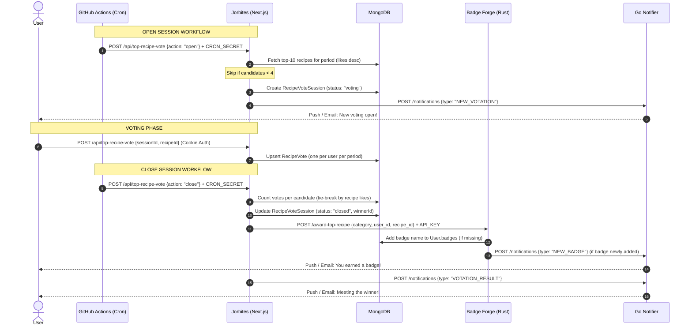

# Automated Top Recipe Voting System

## Overview

The **Automated Top Recipe Voting System** replaces the manual voting process previously conducted on Instagram stories. It enables Jorbites users to vote directly in-app for the best recipes of the **week**, **month**, and **year** (determined by popularity and likes) and automatically awards corresponding badges to the winning authors.

---

## System Architecture

The feature is built across four main components:
1. **Jorbites (Next.js)**: Runs the UI, handles user votes, stores state, and manages the cron routes.
2. **GitHub Actions Workflows**: Triggers the cron jobs to open and close sessions at specific times.
3. **Badge Forge (Rust)**: Decides whether the winner should be awarded a badge and updates MongoDB.
4. **Jorbites Notifier (Go)**: Sends email notifications and web-push notifications to users.

---

## Database Models (`prisma/schema.prisma`)

We use two MongoDB collections to store the state of the voting process.

### `RecipeVote`
Stores individual votes cast by authenticated users.
- `id` (String / ObjectId): Unique identifier.
- `category` (String): `"week"` | `"month"` | `"year"`.
- `periodKey` (String): ISO key for the period (e.g. `"2026-W25"`, `"2026-06"`, `"2026"`).
- `recipeId` (String / ObjectId): The recipe the user voted for.
- `userId` (String / ObjectId): The user who cast the vote.
- `createdAt` (DateTime): Timestamp of the vote.
- **Index**: Compound unique constraint `@@unique([category, periodKey, userId])` to enforce a limit of one vote per user per period.

### `RecipeVoteSession`
Tracks the lifecycle of voting sessions.
- `id` (String / ObjectId): Unique identifier.
- `category` (String): `"week"` | `"month"` | `"year"`.
- `periodKey` (String): ISO key representing the period.
- `status` (String): `"voting"` | `"closed"`. Defaults to `"voting"`.
- `winnerId` (String / ObjectId, Optional): The recipe that won (set once closed).
- `candidates` (String[] / ObjectId[]): The list of top-10 candidate recipe IDs participating in the voting.
- `startedAt` (DateTime): When voting started.
- `closedAt` (DateTime, Optional): When voting ended.
- **Index**: Compound unique constraint `@@unique([category, periodKey])` to enforce one session per period.

---

## Core Workflows

### 1. Opening a Voting Session (Cron)
- **Schedule**: Mondays at 04:30 UTC (week), 1st of month (month), Jan 1st (year).
- **Candidates**: Fetches the top-10 most liked recipes created during the previous period (e.g. previous Monday 00:00 to Sunday 23:59:59.999).
- **Minimum Limit**: Must have **at least 4 recipes** created during that period. If fewer than 4 exist, the session creation is skipped.
- **Notification**: Triggers a `NEW_VOTATION` notification to announce the new vote.

### 2. Casting a Vote
- Users must be authenticated to vote.
- The system verifies that:
  - The voting session exists and has a `"voting"` status.
  - The voted recipe is in the session's `candidates` array.
- Users can change their vote; the vote record is upserted atomically.

### 3. Closing a Session and Awarding Badges (Cron)
- **Schedule**: Tuesdays at 04:30 UTC (week), 2nd of month (month), Jan 2nd (year) — exactly 24 hours after opening.
- **Winner Determination**:
  1. Counts votes grouped by `recipeId`.
  2. Selects the candidate with the highest vote count.
  3. **Tie-breaking**: If there's a tie, the candidate with the highest total `numLikes` wins. If still tied, it falls back to database creation order.
- **Badging**: Calls the Badge Forge `/award-top-recipe` microservice endpoint. Badge Forge checks if the author already holds the badge. If not, it adds the badge slug to the user's document (`recipe_of_the_week`, `recipe_of_the_month`, `recipe_of_the_year`) and sends a `NEW_BADGE` notification.
- **Notification**: Triggers a `VOTATION_RESULT` notification to announce the winner.

---

## API Endpoints Reference

### Next.js App (`jorbites`)
| Endpoint | Method | Headers | Body | Description |
|---|---|---|---|---|
| `/api/top-recipe-vote` | `GET` | Cookie Auth (Optional) | Query: `?category=week` | Returns the active session (with candidates, vote counts, and winner info) and the current user's vote if logged in. |
| `/api/top-recipe-vote` | `POST` | Cookie Auth (Required) | `{ sessionId, recipeId }` | Casts or changes a user's vote. |
| `/api/top-recipe-vote` | `POST` | `Authorization: Bearer <CRON_SECRET>` | `{ action: "open"/"close", category }` | Triggers the cron jobs to open or close sessions. |

### Badge Forge (`badge_forge`)
| Endpoint | Method | Headers | Body | Description |
|---|---|---|---|---|
| `/award-top-recipe` | `POST` | `X-API-Key: <API_KEY>` | `{ category, user_id, recipe_id }` | Awards the category badge to the user if they don't already have it. |

---

## Security Considerations

1. **Cron Protection**: Next.js endpoint POST actions (`open`, `close`) require a `Bearer <CRON_SECRET>` header matching the server's `CRON_SECRET` environment variable to prevent unauthorized triggers.
2. **Microservice Authentication**: The `/award-top-recipe` microservice endpoint requires `X-API-Key` verification in its middleware to prevent arbitrary badge spawning.
3. **Double Voting Prevention**: Compound unique constraint `category_periodKey_userId` in Prisma acts as a database-level lock preventing double-voting.
